# 从零到懂：推荐系统 × 强化学习 课程浓缩指南

> 这份文档把「数学基础 → 机器学习 → 深度学习 → 推荐系统 → 强化学习 → LLM 对齐 →
> 面试冲刺」六门课的核心内容浓缩成一份自足教程，所有概念都用大白话讲清“是什么、
> 为什么、怎么用”，并一一对照本项目的真实代码和数字。你不需要同时开六门课，
> 按章节顺序读，读到哪儿就回项目里找对应实物。
>
> 对应课程（想加深时按章回看）：
> - 第 1 章 ← 3Blue1Brown《线性代数的本质》《微积分的本质》
> - 第 2 章 ← 吴恩达《机器学习》、李航《统计学习方法》
> - 第 3 章 ← 李沐《动手学深度学习》(d2l.ai)
> - 第 4 章 ← 王喆《深度学习推荐系统》、项亮《推荐系统实践》
> - 第 5 章 ← 周博磊《强化学习纲要》、李宏毅 RL、Sutton & Barto
> - 第 6 章 ← 李宏毅 生成式 AI / RLHF、Hugging Face TRL 文档
> - 第 7 章 ← 《百面机器学习》、搜广推面经

> 📌 出处说明：每一章末尾都有「本章出处与我的笔记」——标注了对应课程/书/论文的
> 链接和阅读顺序；你可以在「✍️ 我的笔记」里直接补充自己感兴趣的内容（比如你试出
> 的参数效果、面试被问到的题、读某篇论文的感想）。全文出处汇总见第 10 章。

---

## 第 0 章：怎么用这份文档

### 0.1 学习顺序（总表）

| 章 | 主题 | 学完能看懂的项目名词 | 建议用时（每天 2h） |
|---|---|---|---|
| 1 | 数学基础 | 向量、点积、softmax、梯度、期望、置信区间 | 1–2 周 |
| 2 | 机器学习基础 | AUC、lr、epochs、过拟合、LR/FM、训练/验证/测试 | 3–4 周 |
| 3 | 深度学习 | embedding、dropout、Transformer、注意力、LayerNorm | 4 周 |
| 4 | 推荐系统 | 双塔、logQ、Faiss、DeepFM、DIN、生成式检索、Semantic ID、A/B | 3–4 周 |
| 5 | 强化学习 | MDP、策略梯度、DQN、PPO、GRPO、DAPO/GSPO、CQL/IQL | 4–5 周 |
| 6 | 对齐与 Agent | RLHF、DPO、KTO、KL、Agentic Recommendation、工具与轨迹评估 | 1–2 周 |
| 7 | 面试冲刺 | 把每个名词讲成“一句话+为什么” | 2 周 |
| 8 | 自测与练习 | 检验以上全部 | 穿插进行 |

### 0.2 三条学习方法（比课程本身更重要）

1. **反向索引**：先看项目的名词表，遇到不懂的翻到对应章节；不用从头死磕数学。
2. **项目当实验台**：每学一个概念，回项目里找它的实物——学完 embedding 去
   `src/train_two_tower.py` 看 32 维向量；学完 γ 去 `src/train_dqn_rec.py` 看
   `GAMMA = 0.9`；学完 AUC 去 `REPORT.md` 看 0.754。看得见摸得着才记得住。
3. **先 60% 再精读**：第一遍只求“大概懂、能讲给别人听”；面试前再补细节。

### 0.3 名词速查索引（学完一章勾掉一个）

- 第 1 章后能勾：向量、点积、softmax、梯度、期望、方差、置信区间
- 第 2 章后能勾：AUC、GAUC(初步)、lr、epochs、batch_size、过拟合、L2、验证集
- 第 3 章后能勾：embedding、MLP、ReLU、dropout、LayerNorm、Transformer、注意力、因果掩码
- 第 4 章后能勾：双塔、in-batch softmax、logQ、Faiss、DeepFM、DIN、Semantic ID、RQ-VAE、生成式检索、A/B、SRM
- 第 5 章后能勾：MDP、Bellman、REINFORCE、GAE、DQN、PPO、GRPO、DAPO、GSPO、CQL、IQL
- 第 6 章后能勾：RLHF、DPO、KTO、SimPO、KL、S-DPO、Agentic Recommendation、工具门、轨迹评估

### 0.4 核心知识点的统一读法

后面遇到重要概念，不要从公式开始背。按下面五层逐层理解；能走完一圈，才算真正
掌握，而不只是“眼熟”。


全文使用四种互补的可视化：流程图看因果链，矩阵看“谁和谁计算”，曲线/刻度看
参数变化，比较表看模型取舍。图不是装饰；每看完一张图，都尝试遮住文字自己复述一遍。

### 0.5 怎么读“前沿内容”（更新至 2026-08）

本文新增的 TIGER、OneRec、DAPO、GSPO 与 Agentic Recommendation 用来回答“基础概念
下一步走向哪里”，不用于制造名词焦虑。阅读时看清证据等级：

| 标签 | 代表什么 | 应该怎样使用 |
|---|---|---|
| 成熟基础 | 教科书、经典论文、长期复现的机制 | 必须掌握，能手推、能解释边界 |
| 前沿实证 | 新论文或特定公司线上实验 | 学机制与实验设计，不外推其数字 |
| 前沿框架 | survey / roadmap / preprint 提出的分类 | 用来导航，不当成工业共识 |
| 项目证据 | 本仓库固定协议下的代码与实验 | 只在相同数据、环境和评估协议内解释 |

每个前沿段落都尽量回答三件事：它修改了基础系统的哪个部位、解决了什么已观察到的
失败模式、又引入了什么新成本。只写“某算法更先进”而不回答这三问，等于没有解释。

---

## 第 1 章：数学基础（够用就好）

这一章只建立一条主线：**先把对象变成向量，用点积产生分数，用 softmax 变成概率，
用损失衡量错误，再沿梯度修改向量。** 后面所有模型都只是在重复这条链路。

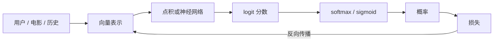

### 1.1 向量：一串数字，就是一个“坐标”

向量就是一串数字，代表空间里的一个点。比如把电影《教父》表示成
`(0.2, 0.8, 0.1, ...)`，每个位置是一种“口味维度”（动作片倾向、剧情片倾向……）。
维度越多，能表达的信息越多，但也越容易过拟合。

> 项目里：`embedding` 就是向量的学名。双塔召回给每部电影学一个 32 维向量，
> 给每个用户学一个 32 维向量，它们的“位置”就是口味坐标。

### 1.2 点积：判断“方向多一致”

两个向量对应位置相乘再全部相加：

```text
a = (1, 2), b = (3, 4)
a·b = 1×3 + 2×4 = 11
```

点积同时受**方向**和**长度**影响：

```text
a·b = ||a|| × ||b|| × cosθ
       长度     长度     方向夹角
```

所以只有在向量长度相同，特别是都做了 L2 归一化（长度变成 1）之后，点积才纯粹
表示方向相似度，也就等于余弦相似度。否则一个方向一般但特别长的向量，也可能拿到
很高的点积。

| 夹角 θ | cosθ | 归一化后的点积 | 直觉 |
|---:|---:|---:|---|
| 0° | 1 | 1 | 完全同向 |
| 90° | 0 | 0 | 没有方向相关性 |
| 180° | -1 | -1 | 完全反向 |

> 项目里：双塔的 `Tower.forward()` 先用 `F.normalize` 把用户和电影向量长度归一，
> 再用 `用户向量 · 电影向量` 打分。因此这里的点积确实就是余弦相似度；Faiss 找的
> 是相似度最大的前 K 个。

### 1.3 矩阵乘法：批量算点积

矩阵是表格。用户矩阵（每行一个用户）× 物品矩阵转置（每列一个物品），结果就是
“每个用户 × 每个物品”的打分表。这就是为什么双塔能一次给全库打分——其实是矩阵乘法。

```text
用户向量 U        电影向量 Vᵀ              得分 S
[B × d]      ×      [d × N]         =       [B × N]
B 个用户            N 部电影                 每格都是 uᵢ·vⱼ
```

先看形状比先看元素更重要：中间的 `d` 被消掉，留下“用户数 × 电影数”。在代码里看到
`u @ item.T` 时，先在纸上写出 `[B,d] @ [d,N] -> [B,N]`，大多数维度错误会立刻暴露。

### 1.4 概率：可能性 + 分布 + 期望

- 概率：0~1 的数，表示事件发生的可能性。
- 分布：把所有可能值连同概率列出来。模型输出常常要变成分布，才能和标签比较。
- softmax：把任意一组分数变成“和为 1 的概率”。分数越高的，概率越大。
  - 温度 T：分数先除以 T。T 大 → 分布平缓（更像均匀随机）；T 小 → 分布尖锐
    （几乎只押最高分）。项目双塔 `TEMP = 0.05` 就是让打分“更自信”。
- 期望：加权平均 = “长期平均能拿多少”。RL 里说“最大化期望回报”就是这个词。
- 条件概率：在已知某条件下的概率。点击率 CTR 就是“用户看到了这部片→点击”的条件概率。

温度的作用可以直接看成“概率柱子的锐度旋钮”。对同一组分数 `[1,2,3]`：

| 温度 T | 三个物品的 softmax 概率（约） | 视觉形状 | 含义 |
|---:|---|---|---|
| 2.0 | `[0.19, 0.31, 0.51]` | `██  ███  █████` | 平缓，保留更多探索 |
| 1.0 | `[0.09, 0.24, 0.67]` | `█  ██  ███████` | 原始分布 |
| 0.5 | `[0.02, 0.12, 0.87]` | `·  █  █████████` | 尖锐，强押最高分 |

注意：softmax 只是把**同一候选集合内**的相对分数归一化，不会自动让概率“校准”。
预测 0.8 是否真的约有 80% 发生，需要另做校准评估。

### 1.5 导数与梯度：怎么“往好的方向走”

- 导数：函数在某点的变化率（斜率）。沿负导数方向走，函数值下降。
- 梯度：多元函数的“最陡上升方向”。梯度下降 = 反复“朝最陡下降方向迈一小步”。
- 链式法则：复合函数求导 = 逐层相乘。神经网络的反向传播就是链式法则的工程化。
- 学习率 lr：每一步迈多大。太大来回震荡甚至发散；太小半天走不到底。

> 项目里：所有训练都是“算损失 → 反向传播（链式法则）→ 梯度下降更新”。
> `lr=0.001` 这种数字就是步子大小。

把训练想成蒙眼下山：梯度告诉你脚下最陡的上坡方向，取负号就是下坡；学习率决定
一步跨多远。

```text
损失高        ╲          ╱       lr 太大：跨过谷底，来回震荡
               ╲  ↓∇L  ╱        lr 合适：逐步靠近谷底
损失低          ╲____╱          lr 太小：方向对，但走得很慢
                    参数 w →
```

一次更新可以读成：`新参数 = 旧参数 − 学习率 × 当前梯度`。梯度不是“正确答案”，
只是当前位置的局部路标；这也是非凸网络可能走到不同解、训练需要多步迭代的原因。

### 1.6 统计：方差、置信区间、偏差-方差

- 均值：一组数的平均。方差/标准差：这组数有多“飘”。
- 95% 置信区间：如果反复“抽样→按同一方法构造区间”，长期约 95% 的区间会覆盖
  真值。它不是说“这次算出的固定区间有 95% 概率包含真值”。反馈闭环里
  “bootstrap 95% 区间跨过 0”的实用解释是：当前数据还不能稳定排除“没有提升”。
- 偏差 vs 方差：偏差大 = 打偏了（模型太简单）；方差大 = 打飘了（模型太复杂或数据太少）。
  过拟合 = 低偏差高方差。

> 项目里：GAE 的 λ 就是在调“偏差-方差”天平（见第 5 章）；OPE 的 ESS 是
> “权重方差太大 → 结论不可信”的量化。

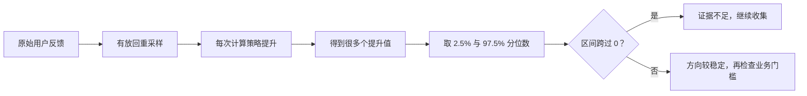

### 📖 小白补充：动手算一遍（数学）

1. **点积 = 长度 × 长度 × 方向一致程度**：向量 (1,2) 和 (2,4) 点积 = 10，方向
   一致但长度也更长；若先归一化，两者点积为 1。和 (-1,-2) 归一化后的点积为 -1。
   推荐里通常先归一化，再让点积只表达方向相似度；本项目双塔正是这样做的。
2. **softmax 手算**：分数 [1, 2, 3] → e¹≈2.72、e²≈7.39、e³≈20.09 → 概率
   [0.09, 0.24, 0.67]。加温度 0.5（先除 0.5 → [2, 4, 6]）→ 概率变成
   [0.016, 0.117, 0.867]——最高分几乎独吞。这就是“温度越小，分布越尖锐”。
3. **期望 = 长期平均**：骰子点数期望 = (1+2+3+4+5+6)/6 = 3.5。RL 说“最大化期望
   回报”就是“让长期平均收益最大”。
4. **γ 折扣预告**：γ=0.9 时，明天的 1 分今天值 0.9，后天值 0.81，10 步后只剩
   0.35——越远越不值钱，所以策略会被逼着“先保住眼前，再顾长远”。

### 本章出处与我的笔记

**出处**
- 3Blue1Brown《线性代数的本质》（B站有官方翻译）: https://www.3blue1brown.com/topics/linear-algebra
- 3Blue1Brown《微积分的本质》: https://www.3blue1brown.com/topics/calculus
- 李沐《动手学深度学习》预备知识章（线性代数/概率/自动求导）: https://zh.d2l.ai/chapter_preliminaries/index.html
- 吴恩达《机器学习》（Coursera，数学直觉部分）: https://www.coursera.org/learn/machine-learning
- 补充读物：《程序员的数学 2：概率统计》（结城浩）——概率直觉写得很好。

**深入阅读顺序**：3Blue1Brown 线性代数前 6 集 → d2l 预备知识 → 需要时再翻概率。

**✍️ 我的笔记**

（示例：点积为什么能当相似度——先做 L2 归一化后，点积才等于余弦相似度；我自己试了 32 维 vs 64 维……）

### 1.7 本章自测

1. 点积为 0 的两个非零向量说明什么？（答：方向垂直；若已归一化，余弦相似度为 0）
2. softmax 温度从 1 改成 0.05，输出分布会怎样？（答：更尖锐，几乎只押最高分）
3. lr 太大通常会出现什么现象？（答：损失震荡甚至发散）

---

## 第 2 章：机器学习基础

### 2.1 监督学习三要素：数据、模型、损失

机器学习就是“从例子中学规律”：

```text
数据 (X, y)  →  模型 f  →  预测 ŷ  →  损失 L(y, ŷ)  →  调参数让损失变小
```

- 特征 X：能观察到的信息（年龄、性别、电影类型、最近看过什么）。
- 标签 y：要预测的东西（点没点、喜不喜欢）。
- 模型 f：把 X 变成预测的函数（线性、神经网络……）。
- 损失 L：衡量“预测离真相有多远”。

> 项目里：DeepFM 复用了 CTR 二分类架构，但标签是“已发生评分是否≥4”。MovieLens
> 没有曝光/未点击日志，因此输出不能解释成点击概率；这是显式偏好 proxy。

训练不是从数据直接“算出模型”，而是一个反复纠错的闭环：

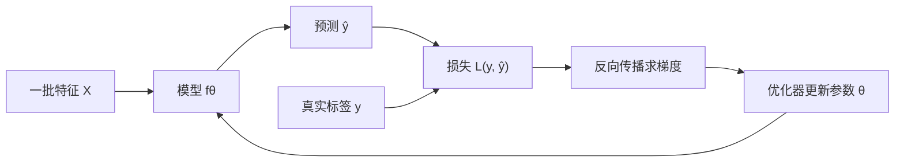

这里有三个不能混的目标：训练时最小化**损失**，调参时最大化**验证指标**，最终只在
**测试集**报告一次泛化结果。损失是可求导的训练代理，不一定等于业务真正关心的指标。

### 2.2 三类任务

- 分类：预测类别（点击/不点击 = 二分类）。
- 回归：预测连续值（评分 3.7 分）。
- 排序/学习排序（LTR）：预测“谁该排前面”（NDCG 就是排排序质量的）。

### 2.3 两种核心损失

- 均方误差 MSE：`(预测 − 真值)²` 的平均。回归用。
- 交叉熵（log loss）：分类用。直觉：**自信地犯错惩罚最重**。
  真标签是 1，模型说 0.9 → 小损失；模型说 0.1 → 大损失。

### 2.4 训练的三个旋钮：lr、batch_size、epochs

- batch_size：攒多少条样本更新一次参数（32 条 = 一次看 32 条再走一步）。
- epoch：把整个训练集从头到尾过一遍。epochs=15 就是过 15 遍。
- lr：每步走多远。
- 优化器：Adam 是深度学习默认选择，给每个参数自适应步长，不用手调太多。

三个旋钮控制的是三个不同问题：

| 旋钮 | 它真正控制什么 | 太小 | 太大 |
|---|---|---|---|
| `lr` | 每次改参数的幅度 | 收敛慢 | 震荡、发散 |
| `batch_size` | 一次梯度用了多少样本 | 噪声大、显存省 | 梯度稳、显存贵，可能泛化变差 |
| `epochs` | 同一训练集被重复使用几遍 | 欠拟合 | 过拟合风险上升 |

数据集分工也可以用“上课—模考—高考”记：

```text
训练集：更新参数，可反复看  ──►  验证集：选超参/选轮次  ──►  测试集：只做最终报告
       学习材料                         模拟考试                         封存试卷
```

如果看着测试集结果继续调参，测试集就被偷偷变成了验证集，最后的数字会过于乐观。

### 2.5 过拟合：最大的敌人

过拟合 = 训练集背答案背得好，考试（测试集）露馅。欠拟合 = 两边都不好。

对策（按常用顺序）：
1. 更多/更干净的数据；
2. 正则化：L2 惩罚参数太大（参数别太极端）；
3. dropout（见第 3 章）；
4. 早停：验证集不涨了就停；
5. 验证集选优：每轮在验证集（模拟考）打分，保留最好的权重，最后用测试集
   （期末考）报最终数字。

> 项目里真实案例：矩阵分解训练 loss 一路降，Recall 却崩了——典型过拟合；
> 加 L2 正则 + 验证集选优后救回来。SASRec 的 `eval_every=10` 就是这个“模拟考”频率。

```text
误差
高 │╲  训练误差
   │ ╲________________
   │   ╲        ╱  验证误差
低 │    ╲______/ 
   └────────┬──────────► 训练轮次
            ↑
       最佳检查点；再往后是过拟合区
```

判断过拟合要看“训练与验证之间的缝”是否持续扩大，不能只看训练 loss 是否漂亮。
早停保存的是验证指标最好的检查点，不一定是最后一个 epoch。

### 2.6 评估指标：为什么用 AUC

- 准确率：猜对的比例。点击场景正负样本极度不平衡，准确率没有意义。
- 精确率/召回率：精确率 = 推的里面对的占比；召回率 = 对的里面推到的占比。
- AUC：把“判定阈值”从高到低扫一遍，画“真阳率 vs 假阳率”曲线，求曲线下面积。
  - 0.5 = 随机排序；1.0 = 所有正样本都排在负样本前。
  - 优点：不必先选固定阈值，衡量的是正负样本的整体排序能力。
  - 边界：它不告诉你概率是否校准，也不直接回答 Top-K 头部好不好；正例极少时还应
    同看 PR-AUC、Precision/Recall 或业务 Top-K 指标。不存在脱离数据和业务的
    “AUC 到 0.8 就可上线”。
- GAUC：**先在每个用户内部算 AUC，再把各组聚合**。为什么？全局 AUC 会比较
  “用户 A 的正例”和“用户 B 的负例”，把用户基础点击率差异混进个性化排序能力。
  聚合可以等权，也可以按曝光数加权；两种口径含义不同，报告时必须写清。（第 4 章细讲）
- HR@K：正确答案在不在前 K 里。NDCG@K：还要看排名多靠前、越靠前加权越大。

> 项目里：DeepFM 测试 AUC = 0.754；SASRec 用 HR@10 / NDCG@10；双塔用 Recall@10。

先问任务，再选指标：

| 你真正想知道什么 | 首选指标 | 它看见了什么 | 它看不见什么 |
|---|---|---|---|
| 随机正样本能否排过随机负样本 | AUC / GAUC | 成对排序；GAUC 限制在用户组内 | Top-K 头部、概率校准 |
| 唯一目标是否进入前 K | HR@K / Recall@K | 有没有找回来 | 第 1 名和第 K 名差异 |
| 正确结果是否尽量靠前 | NDCG@K | 位置折扣后的排序质量 | 线上时长、留存 |
| 点击概率是否可信 | LogLoss + 校准曲线 | 概率质量 | 业务收益 |
| 新策略能否上线 | A/B + 置信区间 | 真实因果增量 | 长期外溢效应 |

### 📖 小白补充：动手算一遍（评估）

1. **交叉熵**：真标签是“点击”(1)。模型 A 预测 0.9 → 损失 -ln(0.9) ≈ 0.105；
   模型 B 预测 0.1 → 损失 -ln(0.1) ≈ 2.30。B 被罚得很惨——**“自信地犯错”最痛**。
2. **AUC 的大白话定义**：随机抽一个“喜欢”的样本、一个“不喜欢”的样本，
   AUC = 喜欢样本被排在前面（分数更高）的概率。全排对 = 1.0，瞎猜 = 0.5。
   项目 0.754 = 在已评分样本中随机抽一个正向评分和一个非正向评分，有 75.4%
   的概率把前者排在后者前面；它不是“点击概率为 75.4%”。
3. **为什么不用准确率**：100 个样本 99 个不点击，模型永远说“不点”也有 99% 准确率，
   但它一个都没推对。AUC 不需要固定分类阈值、关注成对排序，所以 CTR 场景常用；
   但正例极稀少时仍要结合 PR-AUC 或 Top-K 指标，不能说它完全不受不平衡影响。
4. **GAUC 再解释**：全局 AUC 会把不同用户的样本互相比较，而有些用户天生更爱点。
   GAUC 先让每个用户只在自己的候选里考试，再聚合各用户成绩。等权聚合更接近
   “每人一票”，按曝光数加权更接近“每次曝光一票”；不要只报 GAUC 而省略权重口径。

### 2.7 两个必懂经典模型：LR 和 FM

- 逻辑回归 LR：线性得分过 sigmoid 变成概率。CTR 最老的 baseline，可解释。
- FM（因子分解机）：LR + 二阶交叉项
  `Σ_{i<j} <v_i,v_j> · x_i · x_j`，专门解决“特征两两交叉”。它不为每一对特征
  单独存一个 `w_ij`，而是给每个特征一个短向量 `v_i`，用向量点积共享统计力量。
  所以即使“北京 × 科幻”这对组合很少见，也能借“北京”和“科幻”各自在其他组合里
  学到的向量估计交叉权重。

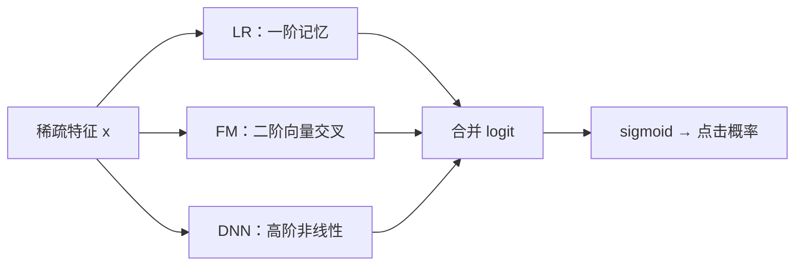

> 项目里：DeepFM = FM 的交叉部分 + 深度网络的非线性部分，两者共享 embedding。

### 本章出处与我的笔记

**出处**
- 吴恩达《机器学习》（Coursera）：监督学习、过拟合与正则、评估）: https://www.coursera.org/learn/machine-learning
- 李航《统计学习方法》（第 1~6 章：感知机/LR/朴素贝叶斯；注意 FM 不在书里）: https://book.douban.com/subject/10590856/
- 周志华《机器学习·西瓜书》第 2 章（模型评估与选择）、第 3 章（线性模型）: https://book.douban.com/subject/26708119/
- FM 原文：S. Rendle, Factorization Machines, ICDM 2010: https://dl.acm.org/doi/10.1109/ICDM.2010.127
- AUC 经典讲解：T. Fawcett, An Introduction to ROC Analysis（2006）
- 李沐 d2l 线性网络/softmax 回归章: https://zh.d2l.ai/chapter_linear-networks/index.html

**深入阅读顺序**：吴恩达前 6 周（重点：逻辑回归、正则、评估）→ 西瓜书第 2 章 → FM 原文。

**✍️ 我的笔记**

（示例：AUC 不依赖阈值这点我一开始总忘——可以自己写 10 个样本手算一遍 ROC 曲线。）

### 2.8 本章自测

1. 为什么点击率预测不用准确率，用 AUC？（答：样本不平衡；AUC 不依赖阈值）
2. 训练 loss 一直在降，但测试指标变差，先怀疑什么？（答：过拟合）
3. epochs 和 batch_size 分别控制什么？（答：过几遍数据；一次看几条再更新）

---

## 第 3 章：深度学习

### 3.1 神经元与 MLP：把“特征”变成“预测”的黑箱

一个神经元：输入加权求和 → 加偏置 → 过激活函数。

```text
输出 = 激活( w₁x₁ + w₂x₂ + ... + b )
```

激活函数的作用是引入非线性，否则多少层都等于一层：
- ReLU：负数变 0，正数不变。最常用。
- Sigmoid：压到 0~1，当概率用。
- Tanh：压到 −1~1。

多层感知机 MLP = 很多层神经元叠起来。LayerNorm：对每层输出做归一化，让数值稳定、
训练更稳——项目里 DQN 和 BC 网络都用它。

```text
输入特征 ──► 线性层 ──► ReLU ──► 线性层 ──► logit ──► 概率
              学组合       加弯曲       再组合
```

“深”不是目的。每多一层，模型能表达的函数更复杂，但也更难训练、更容易过拟合。
LayerNorm 是对**单个样本的一层隐藏维度**做标准化，不是把不同用户混在一起平均；
它和 BatchNorm 的归一化轴不同，因此更适合序列模型和变长输入。

### 3.2 反向传播：深度学习怎么学

链式法则：`∂L/∂w = ∂L/∂ŷ · ∂ŷ/∂z · ∂z/∂w`，从输出一层层往回乘。

两个工程问题：
- 梯度消失：层数深了梯度乘着乘着变成 0 → 用 ReLU/残差缓解。
- 梯度爆炸：梯度变得极大 → 用**梯度裁剪**（`clip_grad_norm`）：超过阈值就按比例缩小。

> 项目里到处是 `nn.utils.clip_grad_norm_(..., 10.0)`——这就是防爆炸的标准动作。

正向传播负责“算答案”，反向传播负责“追责”：

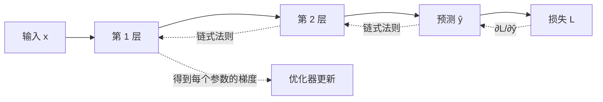

反向传播不是“把数据倒着输入”，而是复用正向计算图，从损失开始把每个局部导数
相乘，算出“每个参数为这次错误负多少责任”。

### 3.3 Embedding：把 ID 变成向量（推荐系统的心脏）

ID 特征（用户 12345、电影 678）如果用 one-hot，就是一个几千万长度的向量、只有
一个 1，既稀疏又算不出相似度。Embedding 的做法：给每个 ID 学一个短向量
（32 维），查表拿到它，两个 ID 的相似度 = 向量点积。

关键直觉：embedding 不是人工填写的“动作片程度”，而是一张被任务损失共同更新的
参数表。若目标要求《教父》和《好家伙》在相似上下文中得到相似预测，梯度就会让
它们的向量靠近；若训练目标不同，学出的几何关系也会不同。**相似性来自监督目标，
不是只要共现就必然自动靠近。**

```text
one-hot(电影 678)       Embedding 表 E              查表结果
[0,0,...,1,...,0]  ×   [物品数 × 32]       ──►     E[678] = 32 维向量
 几千维、几乎全 0          可训练参数                     稠密、可比较
```

一次训练只直接更新 batch 中查到的那些行，因此冷门 ID 学得慢；这也是内容特征、
正则化和冷启动策略仍然必要的原因。

> 项目里：`nn.Embedding(n_items+1, d)` 就是这张表；`d=64` 是向量宽度。

### 3.4 交叉熵 + softmax + 温度

模型最后输出 logits（任意分数）→ softmax 变成概率 → 和真实标签算交叉熵。
温度 T 在 softmax 里是 `softmax(logits / T)`：
- T 大：概率分布平缓（温和）；
- T 小：分布尖锐（自信）。

> 项目双塔 `TEMP=0.05`：让“相似”和“不相似”差距更明显，对比学习常用技巧。

### 3.5 Dropout：训练时的“随机缺勤”

每次训练迭代随机“关掉”一部分神经元（比例 = dropout rate），逼网络不依赖单一路径，
相当于训练了很多子网络再平均。预测时全开。

> 项目 SASRec `dropout=0.2`；消融发现 0.5 太重（掉 4.7% 分数）——小数据经不起
> 太狠的正则。

### 3.6 Transformer：读序列的注意力机器（SASRec 的骨架）

先记住问题：序列推荐要回答“用户看了 A、B、C 之后，下一步最想看什么？”关键是
**不同历史片段的重要性不同**——刚看完《教父》的人可能想看《好家伙》，而不是再推
一部动画片。

自注意力三步：
1. 每个位置算出三个向量：Q（查询）、K（键）、V（值）；
2. 用 `Q·K / sqrt(d_k)` 决定“我要多关注谁”（缩放防止维度大时分数过尖，
   再经 softmax 归一）；
3. 按权重加权求和 V，得到这个位置的新表示。

三个必懂细节：
- **因果掩码（causal mask）**：位置 i 只能看 ≤ i 的历史，不能偷看未来。
  SASRec 用上三角掩码实现；BERT 双向、不用掩码。
- **位置编码**：注意力本身不区分“第几个”，所以要加位置信息（SASRec 用可学习
  位置向量）。
- **残差 + LayerNorm**：`x = LayerNorm(x + 注意力(x))`，让深层网络可训练。
- 多头注意力：多组 QKV 并行，学不同类型的关系。

因果掩码最适合看成一张“可见性矩阵”。行是当前要预测的位置，列是它想读取的历史：

| 当前位置 \ 可读取位置 | 1《教父》 | 2《好家伙》 | 3《玩具总动员》 | 4 下一步 |
|---|:---:|:---:|:---:|:---:|
| 1《教父》 | ✓ | × | × | × |
| 2《好家伙》 | ✓ | ✓ | × | × |
| 3《玩具总动员》 | ✓ | ✓ | ✓ | × |
| 4 下一步 | ✓ | ✓ | ✓ | ✓ |

对角线上方全部遮住，模型训练时就不能用未来物品解释过去。这条约束不是性能技巧，
而是评估可信性的底线。

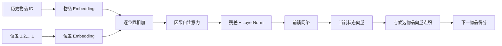

> 项目里：SASRec = 物品 embedding + 位置 embedding → N 个因果注意力块 → 输出
> “当前状态向量”，再和候选电影 embedding 点积打分。`maxlen=200` 是窗口，
> `blocks=2→3` 是层数（消融：3 层略好）。

### 📖 小白补充：动手算一遍（深度学习）

1. **反向传播一个数**：设 y = w·x，损失 L = (y−1)²。x=2，w 猜 1 → y=2，L=1。
   损失对 w 的梯度 = 2(y−1)·x = 2×1×2 = 4 → 往反方向走，w 应减小。这就是
   “算错多少、往哪调、调多少”三件事，神经网络只是把这个过程自动做一万遍。
2. **注意力手算**：3 个词“我 / 爱 / 猫”。假设缩放后的 QK 分数是 0.2、0.5、1.0，
   softmax 权重约为 `[0.22, 0.30, 0.49]` → 新表示约等于
   0.22×我 + 0.30×爱 + 0.49×猫。自己和自己的权重最高，同时带上上下文——
   “猫”的新向量里混进了“爱”的信息。
3. **embedding 为什么能学出相似**：不是“共现”三个字在起魔法，而是损失要求模型
   在相似历史里给“教父”和“好家伙”相近的高分，梯度才会把相关向量调到相近方向。
   换一个任务或负采样方法，空间结构也可能变化。
4. **因果掩码一句话**：算位置 3 时，只允许看位置 1、2、3，位置 4 必须“蒙住”，
   否则模型等于偷看了未来的答案。

### 3.7 深度学习的调试心法（面试高频）

- 训练不收敛：先查 lr 太大、特征没归一化、梯度爆炸（加裁剪）。
- 过拟合：数据、正则、dropout、早停、验证集选优。
- 损失不降但指标在涨：可能是评估口径问题，先确认“考的是同一套题”。

### 本章出处与我的笔记

**出处**
- 李沐《动手学深度学习》: https://zh.d2l.ai/ （重点章节：MLP、反向传播、dropout、注意力、Transformer）
- 吴恩达《深度学习专项》（Coursera）: https://www.coursera.org/specializations/deep-learning
- Transformer 原文：Vaswani et al., Attention Is All You Need, 2017: https://arxiv.org/abs/1706.03762
- SASRec 原文：Kang & McAuley, Self-Attentive Sequential Recommendation, ICDM 2018: https://arxiv.org/abs/1808.09781
- 斯坦福 CS231n（反向传播讲得最细）: http://cs231n.stanford.edu/

**深入阅读顺序**：d2l 的 MLP → 反向传播 → 注意力/Transformer；Transformer 只看原文第 3 节（模型结构）就够入门。

**✍️ 我的笔记**

（示例：因果掩码和 BERT 的双向掩码区别，我画过一张图才真正懂……）

### 3.8 本章自测

1. Embedding 解决了 one-hot 的哪两个问题？（答：稀疏算不了相似度、维度爆炸）
2. 因果掩码的作用是什么？（答：防偷看未来，保证“只用历史预测未来”）
3. dropout 在训练和预测时行为有何不同？（答：训练随机关神经元，预测全开）

---

## 第 4 章：推荐系统（工业全景）

### 4.1 问题定义与两段式架构

推荐 = 从几百万物品里挑出用户最可能喜欢的 Top-K。全库精排太慢，所以工业标准是：

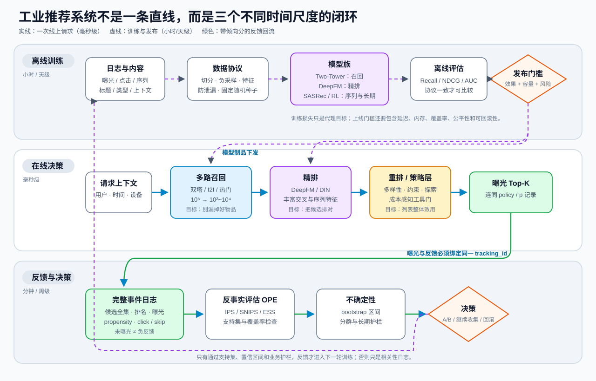

**读图顺序**：先沿中间蓝色实线走完一次毫秒级请求，再沿绿色箭头看曝光如何变成
可评估日志，最后沿紫色虚线看模型怎样经过离线评估和发布门槛回到线上。真正的推荐
系统至少有三种时间尺度，绝不是“请求进来→模型吐 Top-K”这一条线。

这不是三个模型名字，而是三个计算预算：越靠前处理的物品越多，所以单个物品能花的
计算越少；越靠后候选越少，才有资格使用序列、交叉特征和复杂业务约束。

| 阶段 | 最怕什么 | 优先目标 | 常见模型 |
|---|---|---|---|
| 召回 | 喜欢的物品根本没进候选 | 高 Recall、低延迟 | 双塔、I2I、热门 |
| 精排 | 好候选顺序排错 | AUC/GAUC/NDCG、校准 | DeepFM、DIN |
| 重排 | 列表重复或违反约束 | 列表整体效用 | MMR/DPP/规则 |

### 4.2 特征工程：推荐系统的“原料”

按来源分：
- ID 类：用户 ID、物品 ID（靠 embedding 学）。
- 属性：年龄、性别、电影类型。
- 统计：热度、播放频次、历史点击率。
- 序列：最近看过/点过的物品列表（喂给 DIN/SASRec）。
- 上下文：时间、地点、设备。

交叉特征：两个特征组合出新含义，如“喜欢喜剧 × 当前是周末”。FM/DeepFM 就是自动学交叉。

### 4.3 召回：先把范围缩小

#### 多路召回（工业标配，面试必问）

- U2I：双塔，用户向量 × 物品向量。
- I2I：相似物品（“看过 A 的人还看 B”）。
- 热门兜底：新用户没历史时顶住。
- 语义召回：标签/文本相似。

几路召回的结果要融合（分数加权、规则去重、按路分层）。**单路召回会漏**——这是
项目目前只有双塔一路的短板。

#### 双塔：召回的标准答案

结构：用户塔 f(用户特征) → 用户向量 u；物品塔 g(物品特征) → 物品向量 v；
打分 = u·v。两塔可以各自独立缓存向量 → 全库检索毫秒级。

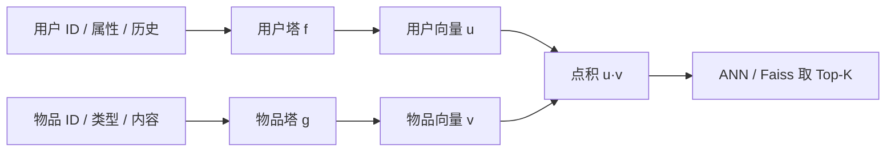

双塔快的关键不是“神经网络小”，而是物品向量可以离线算好并建索引。线上只算一次
用户向量，再做向量检索。代价是两塔在点积前不直接交互，表达力弱于精排模型。

#### 双塔怎么训练：批内负采样 + logQ 校正（面试最爱的追问点）

一个 batch 有 B 个 (用户, 正样本电影)。用户塔出 B 个用户向量，物品塔出 B 个电影
向量，两两点积得到 B×B 打分矩阵：

```text
       电影1  电影2  电影3  ...
用户1  [正]   负     负
用户2   负   [正]    负
用户3   负    负    [正]
```

对角线是正样本，其余 B−1 个是“免费的负样本”，交叉熵逼对角线得分最高。

问题：**批内负样本不是从全库均匀抽的**。它们来自训练数据的物品分布 `q(j)`，热门
电影进入候选的概率更高。如果直接做 softmax，模型会把“采样器更常把谁拿来比较”
混进分数。logQ 校正对候选 j 使用：

```text
校正分数(j) = 原始相似度(j) / T − log q(j)
```

它校正的是**候选被采到的机会不均等**，不是简单“给热门片赔分”。因为 `q<1`，
`−log q` 为正；越少被采到的物品，补偿越大，从而抵消热门物品在采样候选中的
过度代表。

| 物品 | 采样概率 q | `−log q`（约） | 得到的校正 |
|---|---:|---:|---|
| 热门片 | 0.30 | +1.20 | 较小 |
| 长尾片 | 0.03 | +3.51 | 较大 |

两者原始相似度相同，则长尾片校正后高 2.31。这不等于线上强推长尾；它只是尽量让
训练目标恢复到“如果候选来自全库”时的相对打分。校正是否有效仍要看同一评估协议下
的 Recall/NDCG。

> 项目里已实现：`logits = u @ it.T / TEMP - log_q`（`src/train_two_tower.py`），
> 这就是 logQ 校正 + 温度。

#### 向量检索：Faiss 与 ANN

- IndexFlatIP：暴力精确算所有点积，库小够用。
- 近似索引（工业大规模必用）：
  - IVF：先分桶（倒排），只搜几个桶 → 快但可能漏。
  - HNSW：图结构，跳着搜。
  - PQ：向量压缩，省内存。
- 权衡：近似索引召回率略降、速度大增 → 要画“Recall@K vs 延迟”曲线。

```text
召回质量 ↑
  精确检索 ●
          │  ╲
          │    ● 较保守的 ANN
          │       ╲
          │          ● 更激进的 ANN
          └──────────────────► 查询速度
             慢                 快
```

这里的 Recall 是“近似索引找回了多少精确 Top-K”，不是业务测试集的 Recall@K；
两个同名指标分母不同，实验报告必须写清楚。

> 项目现状：只有 IndexFlatIP（3706 部暴力算）。IVF/HNSW 权衡曲线是已列出的下一步。

#### 前沿连接：从向量检索到生成式推荐

双塔把召回写成“用户向量与物品向量匹配”，生成式推荐则尝试把它改写成“像生成文字
一样生成下一个物品或整张列表”。先看三种范式怎样对应：

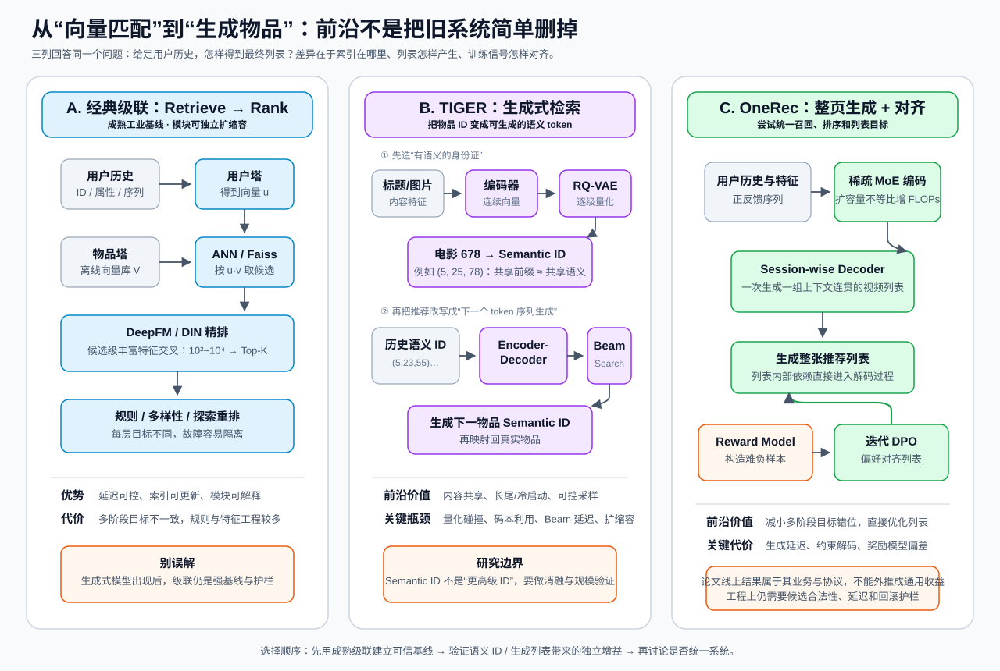

**1. Semantic ID 到底是什么？** 传统 atomic ID（如电影 678）只是地址，678 和 679
并不更相似。TIGER 先用文本编码器得到内容向量，再用 RQ-VAE 逐级量化成若干 codeword，
例如 `(5,25,78)`；共享前缀的物品被设计成共享一部分语义。Transformer 随后不再从
Faiss 索引取最近邻，而是自回归生成目标 Semantic ID。也就是说：

```text
双塔：历史 → 用户向量 → ANN 搜索物品向量库
TIGER：历史 Semantic IDs → Transformer → 逐 token 生成下一个 Semantic ID
```

TIGER 的论文实验把这种能力连接到长尾、冷启动和可调采样，但它不代表“生成一定比
检索好”：量化碰撞、码本利用率、Beam Search 延迟、新物品映射和大规模扩缩容都会
变成新问题。[TIGER / NeurIPS 2023](https://arxiv.org/abs/2305.05065)

**2. 为什么还要生成整张列表？** 经典系统先给每个物品单独打分，再靠重排规则处理
“列表里不要全是同一类型”。OneRec 尝试一次生成 session 级视频列表，并用稀疏 MoE
扩展容量，再用奖励模型构造难负样本、迭代 DPO 对齐列表偏好。论文报告了其特定业务
场景中的线上观看时长提升，但这个数字属于快手的数据、系统与实验协议，不能外推为
通用收益。[OneRec, 2025](https://arxiv.org/abs/2502.18965)

**3. 前沿论文真正提醒了什么？** 2025 年的 GRID 开源基准发现，Semantic ID 生成式
推荐中许多容易忽略的架构选择都会显著影响结果；另一项规模研究进一步报告 SID 表示
容量可能很快成为扩模瓶颈。因此更稳妥的学习路线是：先把双塔/SASRec 作为可信基线，
再逐项验证内容编码器、量化器、生成模型和解码器，而不是只比较最终模型名字。
[GRID](https://arxiv.org/abs/2507.22224)；
[Semantic ID scaling study](https://arxiv.org/abs/2509.25522)

### 4.4 精排：CTR 模型的进化链（面试必背）

本节讲的是工业 CTR 架构谱系。项目里的 DeepFM 只把这套架构迁移到 MovieLens
正向评分分类；因为缺少曝光日志，项目指标不能冒充真实 CTR。

```text
LR → FM → Wide&Deep → DeepFM → DIN（序列）→ DIEN → 多目标（MMoE/ESSM）
```

不要把这条链背成“越右越先进”。每一步是在增加一种能力，也增加一种成本：

| 模型 | 新增能力 | 仍然缺什么 | 额外成本 |
|---|---|---|---|
| LR | 一阶可解释权重 | 自动特征交叉 | 最低 |
| FM | 稀疏二阶交叉 | 高阶非线性 | 低 |
| DeepFM | 二阶 + 高阶交叉 | 针对候选的动态兴趣 | 中 |
| DIN | 候选感知的历史注意力 | 兴趣随时间演化 | 中高 |
| DIEN | 用序列单元建模兴趣演化 | 多业务目标关系 | 高 |
| MMoE/ESSM | 共享表示下的多任务/漏斗 | 任务冲突仍需调权 | 高 |

- Wide&Deep：一路“记忆”（线性、学显式交叉），一路“泛化”（深度网络）。
- DeepFM：把 Wide 换成 FM，共享 embedding，是 CTR 经典强基线。
- DIN（Deep Interest Network）：**用户历史行为不是等权重的**——候选是《教父》时，
  历史里的黑帮片注意力权重更高。用注意力对历史行为加权。
- DIEN：把注意力换成 GRU 建模兴趣演化。
- 多目标：一次预测点击、时长、转化等多个目标。
  - MMoE：多个“专家”网络 + 门控加权，任务共享又各取所需。
  - ESSM：转化 = 点击 × 点击后购买，建模漏斗。

评估：AUC / GAUC（先按用户计算，再明确等权或曝光加权口径）、NDCG。

> 项目现状：DeepFM 已实现（已评分正向偏好 AUC 0.754，非真实 CTR）；DIN/MMoE
> 未实现——这是排序侧最大的面试缺口。

### 4.5 重排：相关性之外还要多样性

- MMR：相关分 − 冗余惩罚，贪心选。
- DPP：行列式点过程，把“集合多样性”数学化。
- 业务约束：品牌互斥、广告位、公平性。

> 项目里：`diversity_rerank`（贪心 + 类型覆盖，0.15 权重）是 MMR 的简化版；
> 真人反馈显示它只适合做个人候选。

```text
只按相关性：  黑帮1  黑帮2  黑帮3  黑帮4  喜剧1
加入多样性：  黑帮1  喜剧1  科幻1  黑帮2  动画1
               ↑相关      ↑覆盖不同兴趣，但可能牺牲一点单项分数
```

重排优化的是**整张列表**，不能只比较单个物品分数。多样性权重太小没有效果，太大
又会把“不相关但不同”的物品硬塞进来，所以必须和相关性及真人反馈一起评估。

### 4.6 冷启动：没有历史怎么办

- 新用户：热门兜底、人口统计特征、注册时选偏好、小流量试探（bandit）。
- 新物品：内容特征（类型/标题）、“投喂”给少量用户看反馈。
- 项目：bandit 实验（ε-greedy vs LinUCB）就是“边推边学”的冷启动思路。

### 4.7 在线与 A/B 测试

- 模型更新：全量重训（天级）/ 增量更新（小时级）/ 在线学习（实时）。
- A/B 分流：用户哈希分桶，实验组/对照组同时跑，比业务指标。
- 层叠实验：流量被多层实验复用（分层、互不干扰）。
- SRM（样本比例失衡）：如果两个桶的样本流失比例差异大，实验结论不可信。
- 显著性：置信区间 / p 值，区间跨 0 = 没把握。

> 项目里：反馈闭环的 IPS + ESS + bootstrap 试图在日志上回答类似 A/B 的反事实问题：
> 用倾向分纠偏、有效样本量把关、置信区间表达不确定性。但它依赖倾向分正确、支持集
> 充分和无遗漏混杂等假设，证据等级仍低于设计良好的随机 A/B。

### 📖 小白补充：动手算一遍（双塔训练）

1. **in-batch softmax 3×3**：batch 里 3 个用户、3 部电影，打分矩阵：
   ```text
   用户1: [2.1, 0.5, -0.3]
   用户2: [0.4, 1.8, 0.2]
   用户3: [-0.2, 0.6, 1.9]
   ```
   对每行做 softmax，逼“对角线（正样本）”概率最高。用户1 的电影1 得分 2.1
   最高 → 损失小；如果用户1 的电影2 突然得 2.5，就会大罚——这就是“我的正样本
   必须赢过别人的正样本”。
2. **采样分布偏差**：假设电影1 很热门，它被抽进候选的概率 `q=0.3`；长尾电影的
   `q=0.03`。logQ 后两者分别加 `1.20` 和 `3.51`，长尾得到更大的机会校正。
   目的不是偏爱长尾，而是去掉“谁更容易被采样器选中”对训练分类题的干扰。
3. **温度 0.05**：分数先除 0.05（放大 20 倍）再 softmax → 差距被拉开，
   “相似/不相似”更分明，训练出的排序更自信。

### 本章出处与我的笔记

**出处**
- 王喆《深度学习推荐系统》（电子工业出版社）——工业推荐全链路，和本项目几乎一一对应: https://book.douban.com/subject/35501888/
- 项亮《推荐系统实践》（人民邮电出版社）——入门框架: https://book.douban.com/subject/10769749/
- YouTube 双塔召回：Covington et al., Deep Neural Networks for YouTube Recommendations, RecSys 2016: https://research.google/pubs/pub45530/
- 采样偏差校正（logQ）：Yi et al., Sampling-Bias-Corrected Neural Modeling for Large Corpus Item Recommendations, RecSys 2019
- Faiss：Johnson et al., Billion-scale Similarity Search with GPUs: https://arxiv.org/abs/1702.08734
- HNSW：Malkov & Yashunin, 2018: https://arxiv.org/abs/1603.09320
- DeepFM：Guo et al., 2017: https://arxiv.org/abs/1703.04247
- Wide&Deep：Cheng et al., 2016: https://arxiv.org/abs/1606.07792
- DIN：Zhou et al., KDD 2018: https://arxiv.org/abs/1706.06978
- DIEN：Zhou et al., AAAI 2019: https://arxiv.org/abs/1809.03672
- MMoE：Ma et al., KDD 2018: https://arxiv.org/abs/1708.05122
- ESSM：Ma et al., WWW 2018: https://arxiv.org/abs/1804.07931
- MMR：Carbonell & Goldstein, SIGIR 1998；DPP 综述：Kulesza & Taskar, 2012
- LinUCB：Li et al., WWW 2010: https://arxiv.org/abs/1003.0146
- Thompson Sampling：Agrawal & Goyal, 2012: https://arxiv.org/abs/1205.4217
- TIGER（Semantic ID 生成式检索），NeurIPS 2023: https://arxiv.org/abs/2305.05065
- OneRec（整页生成与偏好对齐），2025: https://arxiv.org/abs/2502.18965
- GRID（Semantic ID 生成式推荐开源消融框架），2025: https://arxiv.org/abs/2507.22224
- Semantic ID 规模瓶颈研究，2025: https://arxiv.org/abs/2509.25522
- A/B 测试权威书：Kohavi et al., Trustworthy Online Controlled Experiments
- 李沐 d2l 推荐系统章节（双塔/矩阵分解/序列）: https://zh.d2l.ai/chapter_recommender-systems/index.html

**深入阅读顺序**：项亮（建立全貌，快读）→ 王喆（召回、DeepFM、评估）→ 双塔两篇
原文（YouTube + logQ）→ TIGER（理解 Semantic ID）→ GRID（看组件消融）→ OneRec
（最后再看统一生成与偏好对齐）。

**✍️ 我的笔记**

（示例：面试被问“你们线上几路召回”，我目前只能答双塔一路——补 I2I 和热门路是下一步。）

### 4.8 本章自测
1. 为什么需要召回？为什么双塔适合召回？（答：全库精排太慢；向量可缓存、点积可批量）
2. 批内负采样有什么偏差？logQ 怎么修？（答：候选来自非均匀分布 q；打分减
   `log q(j)`，抵消高频物品在采样候选中的过度代表）
3. AUC 和 GAUC 差在哪？（答：GAUC 只在用户内部比较正负样本，再明确等权或加权
   聚合，避免把跨用户基础点击率差异混进排序能力）
4. DIN 比 DeepFM 多学了什么？（答：用户历史行为对当前候选的注意力加权）
5. TIGER 和双塔召回的“索引”分别在哪里？（答：双塔把物品向量放在 ANN 索引；
   TIGER 把 Semantic ID 的生成规律学进 Transformer 参数，再通过解码产生候选）

---

## 第 5 章：强化学习（最难也最值的一章）

先看地图，再进公式。RL 算法主要沿两条路走：估计“动作值”的值函数路线，或直接
调整“动作概率”的策略路线；Actor-Critic 把两条路合在一起。

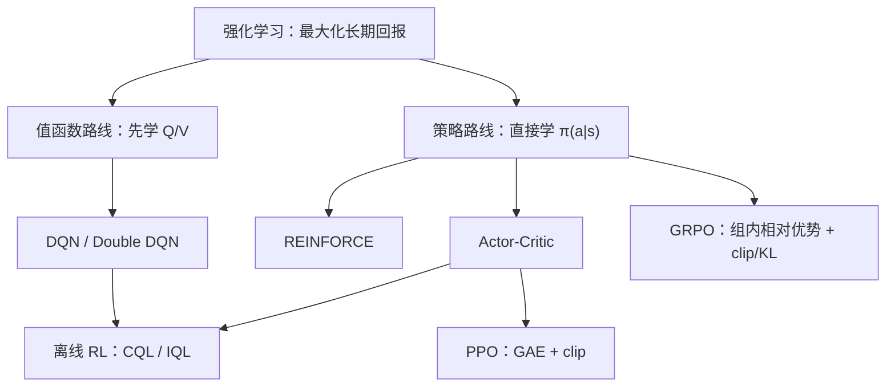

### 5.1 先把名词全对齐：MDP 核心元素

强化学习 = 智能体在环境里“边试边学”，目标是长期收益最大。推荐场景里：

| 名词 | 含义 | 推荐场景的实物 |
|---|---|---|
| 状态 s | 你现在看到的一切 | 用户最近看过什么、疲劳程度（83 维向量） |
| 动作 a | 你能做的选择 | 推哪一部电影（Top200 之一） |
| 奖励 r | 这一步的即时反馈 | 喜欢 +0.9 / 无感 −0.1 |
| 转移 P(s'|s,a) | 做完动作后世界怎么变 | 用户看完后的新历史 |
| 策略 π(a|s) | 看到 s 时选 a 的概率 | 一个神经网络：状态 → 200 个动作的概率 |
| 回报 G | 从某步开始的所有折扣奖励之和 | G = r₁ + γr₂ + γ²r₃ + ... |

> 项目里：`RecSimEnv` 就是环境，`γ=0.9` 是折扣，`SESSION=20` 是回合长度，
> 连续 3 次不喜欢 = 提前终止（流失）。

把它们放进一个闭环，最容易区分：

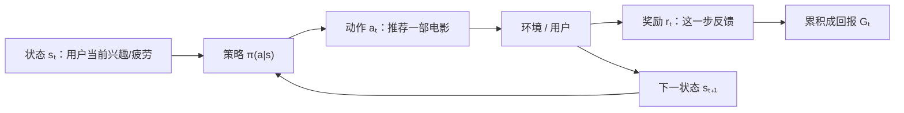

奖励 `r_t` 是一瞬间的反馈，回报 `G_t` 是从现在开始的一串折扣奖励。监督学习通常有
现成标签，RL 的“标签”却会被自己的动作改变：今天推什么，会改变明天用户的状态。
这就是 RL 比普通分类难的根源。

### 5.2 折扣 γ：今天的 1 分和明天的 1 分不一样

γ 决定“多在乎未来”：
- γ=0：目标只含这一步（完全短视）；若每步总选已知即时奖励最高的动作，才表现为贪心。
- γ=1：未来和现在一样重要。
- γ=0.9：明天打九折。这是推荐 RL 的关键：一次高点击可能带来用户疲劳流失，
  长期收益反而低——所以 γ 让系统学会“忍一忍”。

> 项目里的贪心基线只有 2.81 分，RL 学到交错策略能拿 15+ 分，差距来自“愿意为
> 长期放弃眼前”。这里的贪心是一个具体基线，不要把任何 `γ=0` 算法都机械等同于它。

折扣不是一句“未来不重要”就结束，它还有两个工程作用：在无限时域里让回报和保持
有限，并降低遥远、噪声较大的奖励对当前更新的影响。`γ=0.9` 时，不同距离的 1 分权重是：

```text
现在 t      t+1      t+2      t+5       t+10
1.000 ━━━  0.900 ━━ 0.810 ━━ 0.590 ━━  0.349
```

`γ=0` 表示只优化即时奖励；只有当即时奖励已知并总选最高者时，行为才等同“贪心”。

### 5.3 价值函数：给“状态/动作”估值

- V(s)：从状态 s 出发，按策略走下去能拿多少（期望回报）。
- Q(s,a)：在状态 s 先做动作 a，之后按策略走能拿多少。
- Bellman 期望方程：`V^π(s) = E_{a~π,s'}[r + γV^π(s')]`，描述“按当前策略走时，
  状态价值 = 即时奖励 + 下一状态价值”的期望。
- Bellman 最优方程：`V*(s) = max_a E[r + γV*(s')]`，才在动作上取最大值。

二者只差一个 `max`，含义却不同：前者在**评价一个给定策略**，后者在**寻找最优策略**。

```text
V(s)：站在路口，评价“从这里出发总体有多好”
Q(s,a)：站在路口并指定先走 a，评价“这一步之后总体有多好”

                  ┌─ a₁ → Q(s,a₁)
状态 s ──────────┼─ a₂ → Q(s,a₂)       V*(s) = maxₐ Q*(s,a)
                  └─ a₃ → Q(s,a₃)
```

> 项目 DQN 学 Q(s,a)：输入状态，输出 200 个动作的 Q 值，选最大的那个。

### 5.4 策略梯度（REINFORCE）：直接优化“选动作的概率”

思路一句话：**让“带来高回报的动作”概率上升，让低回报动作概率下降**。

梯度公式（要背）：

```text
∇θ J ≈ E[ G · ∇θ log π(a|s) ]
```

直觉：回报 G 是“老师”。若所有回报都可能为正，单说“G 小就把概率往下压”并不
严谨：正的 G 仍会增加概率，只是增加得少。减去基线后看优势 `A=G−V(s)` 才清楚：
`A>0` 表示比预期好，提高这个动作概率；`A<0` 表示比预期差，降低概率。
用 `log π` 是因为它能把整条轨迹概率的乘积变成求和，并得到可估计的梯度形式。

REINFORCE 的问题：**方差大**。同一个状态下同一个动作，不同回合回报可能差很多，
梯度一会大一会小。解法：减基线 → 用优势 `A = G − V(s)`，只保留“比平均水平好多少”
的信号。

> 项目 `train_pg_rec.py` 就是 REINFORCE + Actor-Critic：Actor 出动作概率，
> Critic 出 V(s) 当基线。

```text
实际回报 G=8，Critic 预期 V=5  → A=+3 → 这个动作“超出预期”，概率上调
实际回报 G=2，Critic 预期 V=5  → A=−3 → 这个动作“低于预期”，概率下调
```

### 5.5 GAE：偏差-方差的滑动条

优势估计 A 有两种极端：
- 只看一步 TD：`A = r + γV(s') − V(s)`——方差小，但偏差大（V 不准就带偏）。
- 蒙特卡洛 MC：`A = G − V`——无偏，但方差大。

GAE 用 λ 在两者之间插值：

```text
A_t = δ_t + γλ·δ_{t+1} + (γλ)²·δ_{t+2} + ...
δ_t = r_t + γV(s_{t+1}) − V(s_t)
```

λ=0 只看一步，λ=1 等于 MC。λ=0.95 是常用折中。

| λ | 主要看多远 | 偏差 | 方差 | 依赖什么 |
|---:|---|---|---|---|
| 0 | 一步 TD | 较高 | 较低 | 强依赖当前 V 的准确度 |
| 0.95 | 近处权重大、远处衰减 | 折中 | 折中 | PPO 常用起点，不是万能最优值 |
| 1 | 整段 MC | 较低（完整回合下） | 较高 | 强依赖整条轨迹样本 |

GAE 不是凭空产生新信息，而是决定“把多少步 TD 误差传回当前动作”。λ 越大，信用
分配看得越远，同时把更多轨迹噪声带回来。

> 项目 `train_ppo_rec.py` 的 `compute_gae()` 就是它，还有三个单元测试锁死正确性。

### 5.6 DQN 家族：值函数路线

策略梯度学“动作概率”，DQN 学“动作价值 Q”，选 Q 最大的动作。

三个关键技巧（面试必问）：
- 经验回放：把 (s,a,r,s',done) 存进缓冲池，随机采样训练 → 打破样本相关性。
- 目标网络：用一份“慢更新”的 Q 当目标，避免“用自己教自己”的震荡。
- Double DQN：在线网选动作、目标网估值 → 去掉 max 的过高估计偏差。

```mermaid
flowchart LR
    E["环境交互"] --> M["回放池：s,a,r,s',done"]
    M -->|"随机小批量"| O["在线 Q 网络"]
    O -->|"选择下一动作 argmax"]| T["目标 Q 网络估值"]
    T --> Y["TD 目标 r + γQ_target"]
    Y --> L["与 Q_online(s,a) 算误差"]
    L --> O
    O -. "定期复制参数" .-> T
```

目标网络不是另一个独立模型；它是在线网络的延迟快照。把“出题”和“答题”暂时拆开，
能减少目标值跟着每次参数更新一起移动造成的震荡。

> 项目真实案例：DQN v1 发散（Q 值爆到 549），v2 修复（LayerNorm + 硬目标同步 +
> 每步只更新一次 + 疲劳机制），稳定后约 7.63 分。这个“先发散后修复”的过程
> 面试讲出来很加分。

### 5.7 PPO：策略梯度 + 三个工程旋钮

PPO 解决“REINFORCE 步子不好迈”的问题，三个旋钮：

1. **重要性采样比** `r = π_new(a|s) / π_old(a|s)`：旧数据也能用，算“新策略下的
   概率比旧策略高多少”。
2. **裁剪 clip**：`min(r·A, clip(r, 1±ε)·A)`——r 超过 ±ε 就截断。直觉：
   **收益可以拿，但不能一步改太猛**。ε=0.2 是常用值。
3. **多轮复用 K**：同一批数据用 K 遍，样本效率更高。

再加熵正则：鼓励策略保持随机、别过早固化。

clip 的方向取决于优势正负：

| 优势 A | 希望新策略怎么改 | clip 防止什么 |
|---|---|---|
| `A > 0`（动作好） | 提高该动作概率 | 奖励“提高过猛” |
| `A < 0`（动作差） | 降低该动作概率 | 惩罚“降低过猛” |

PPO 并没有保证每个参数都只变化 20%，也不保证 KL 必然很小；它裁的是**已采样动作的
新旧概率比目标**。所以训练时仍应监控 KL、熵和 clip fraction，而不是只看奖励。

> 项目 `train_ppo_rec.py`：GAE λ=0.95、clip ε=0.2、K=4、熵 0.01。
> 结果：采样部署 15.43 分（多样性 6.87），与 PG 持平但多样性高 26.8%。

### 5.8 GRPO：不用 Critic 的组内相对策略优化

GRPO 因 DeepSeekMath / DeepSeek-R1 路线受到广泛关注。PPO 有个代价：要训练 Critic
（价值网络），显存大、调参多；GRPO 用同一输入的一组采样做相对比较，省掉 Critic：

```text
同一个状态采样 G 条轨迹（一组候选）
  → 算出每条回报
  → 组内标准化（减均值除标准差）当优势 A
  → 用 A 做 clip 策略更新（同 PPO）
  → 加 KL 惩罚：别跑偏参考策略太远（β=0.04）
```

三个必懂点：
- 组内相对优势：不需要绝对分数，只要“这一组里谁更好”。
- 参考策略：通常是训练开始时的模型（论文里是 SFT 模型），KL 防止为奖励把
  策略改坏。
- K 轮复用很重要：实测 K=1 时 GRPO 几乎等于 REINFORCE；K=4 才显现价值。

> 项目 `research_v3/agentic_rec`：工具门控（2 个动作：用不用工具）。GRPO-K4
> 净奖励 15.905 → 16.668（+4.8%），argmax 仍塌缩、规则门仍最优。
> 还踩了一个经典实现坑：参考策略用“更新前快照”+ 单步更新时，GRPO 会数学上
> 退化成 REINFORCE（ratio 恒为 1、KL 梯度为 0）——必须冻结参考 + K>1。

#### 前沿连接：DAPO 与 GSPO 分别在修什么

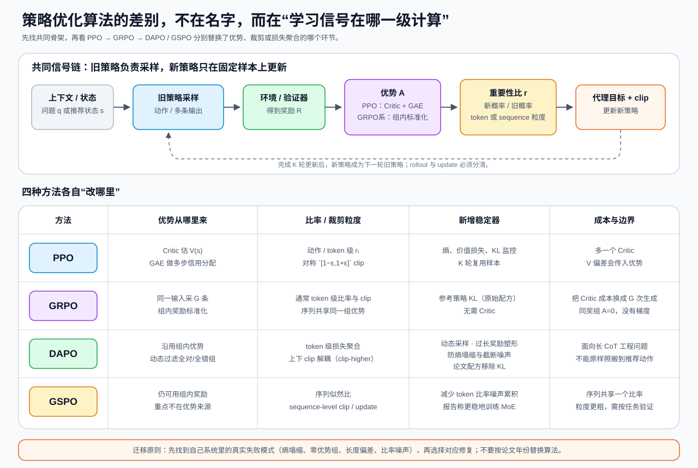

**先沿图上半部看共同骨架**：旧策略采样 → 环境/验证器给奖励 → 估优势 → 计算
新旧概率比 → clip 后更新。然后再看下半部：PPO 与 GRPO 主要在“优势从哪里来”上
不同；DAPO 与 GSPO 则进一步处理大模型长序列训练暴露出的工程失败模式。

**DAPO（2025）**不是给 GRPO 换一个名字，而是一组针对长推理训练的诊断式修复：

- `Clip-Higher`：把上、下裁剪范围解耦，给低概率探索 token 更大的上升空间，缓解熵塌缩；
- 动态采样：过滤组内全对或全错、因而优势全为 0 的 prompt，让 batch 保留有效梯度；
- token-level policy-gradient loss：改变长短回答在 loss 聚合中的权重；
- overlong reward shaping：避免“仅仅因为被长度上限截断”就制造噪声奖励。

论文的长 CoT 配方还移除了 KL 项，这正好说明 **KL 不是 GRPO 永远必带的教条**：
RLHF 需要防策略偏离 SFT 模型，而可验证数学推理可能允许更大偏离。是否保留 KL 要看
目标和奖励漏洞，不看算法缩写。[DAPO](https://arxiv.org/abs/2503.14476)

**GSPO（2025）**改的是另一个位置：GRPO 常在 token 级算重要性比，长序列会积累
局部噪声；GSPO 改用序列似然定义 importance ratio，并在 sequence 级裁剪和优化。
论文报告它在大模型、尤其 MoE 的 RL 训练中更稳定。代价是整条序列共享更粗粒度的
更新信号，是否适合某个任务仍需实验。[GSPO](https://arxiv.org/abs/2507.18071)

“省掉 Critic”也不等于训练免费：GRPO 系方法把一部分 Critic 成本换成了同一输入的
多次生成。对本项目这种**单步二动作工具门**，token 长度、过长截断和序列比率都不是
当前主要矛盾；更值得借鉴的是“同奖组没有梯度”和“先监控熵再调 clip”。这就是把
前沿论文迁移到推荐系统时应有的克制。

### 5.9 离线 RL：只能用日志学（推荐系统的真实约束）

线上不能乱试，只有历史日志。离线 RL 的核心矛盾：**外推误差**。

Bellman 目标里的 `max_a' Q(s',a')` 会挑中“数据里没出现过的动作”，而它的 Q 是
网络瞎猜的、还被 max 系统性地挑成“看起来最高”——自举把高估一轮轮放大。


各方法怎么应对（面试必背）：
- BC/行为克隆：纯模仿日志动作。目标里只有“像不像行为策略”，没有“怎样超过它”的
  直接信号；有限数据下还可能因泛化而偶然更好或因分布漂移更差，不能把“天花板”当定理。
- 奖励加权 BC（RWR）：给高回报样本加权，像“拒绝采样 SFT”。
- CQL：加保守项，压低所有动作的 Q、抬高数据内动作的 Q（α 控制强度）。
- IQL：干脆不用 max，用 expectile 回归的 V 替代，从源头避开 OOD 高估。
- Decision Transformer：把离线 RL 变成“回报条件序列建模”（Transformer 做）。

> 项目结论（反常识但诚实）：同一份日志下 naive DQN 9.43 分 ＞ CQL 3.63 ≈
> IQL 3.35 ≈ BC 2.89。原因：这个环境回报有界（20 步封顶）、200 个动作都合法，
> OOD 高估灾难根本不出现，而“危险”的 max 外推恰恰发现了交错策略。
> **教训：先诊断数据覆盖和回报结构，再决定要不要保守。**

| 方法 | 核心动作 | 优点 | 典型代价 |
|---|---|---|---|
| BC | 模仿日志动作 | 最稳、最简单 | 上限受行为策略限制 |
| CQL | 压低数据外动作的 Q | 防 OOD 高估 | 过度保守会错过可改进动作 |
| IQL | 用 expectile V，避免对数据外动作取 max | 不显式查询 OOD 动作 | 仍受数据覆盖和 AWR 权重影响 |
| Decision Transformer | 给定目标回报预测动作序列 | 统一成序列建模 | 高目标回报必须在数据中有支撑 |

### 5.10 探索：怎么避免“没见过世面”

- ε-greedy：ε 概率随机动作（项目 DQN 用它，ε 从 1 衰减到 0.05）。
- 熵正则：策略梯度里加熵奖励。
- 内在奖励：好奇心（预测误差大 = 没见过 = 多去探索）。RND/ICM 是代表。

### 5.11 面试高频问题速答

1. γ 怎么选？→ 看业务周期与奖励尺度；γ=0 只优化当步奖励，但只有在即时奖励已知、
   每步都取最高值时才等同于贪心，不能机械地把“长留存”固定成 0.9。
2. PPO 为什么稳？→ clip 限制每步更新幅度 + GAE 压方差 + 复用提高样本效率。
3. GRPO 和 PPO 区别？→ GRPO 不训练 Critic，用同一输入的一组采样估相对优势；原始
   配方常加 KL，但 DAPO 等变体会按任务移除，不能把 KL 当成定义的一部分。
4. 离线 RL 怎么防发散？→ 保守（CQL）、免 max（IQL）、约束策略（BC 正则）；
   但先确认外推误差真的存在。
5. 为什么 argmax 部署可能塌缩？→ 训练的是随机策略及其期望回报，熵正则也鼓励一组
   动作保留概率；部署时改成 argmax 会丢掉整个分布，只反复取略高的峰值动作。
   采样能保留多样性，但会增加结果方差，必须用部署指标实测，不能当通用答案。

### 📖 小白补充：动手算一遍（RL 核心公式）

1. **γ 折扣**：回报 [1,1,1,1,1]（5 步每步 +1）。γ=1 → 总回报 5；γ=0.9 →
   1+0.9+0.81+0.729+0.656 = 4.095；γ=0 → 只看第一步 = 1。γ 越小，后面几步越
   “不值钱”，策略越短视。项目里的具体贪心基线只有 2.81 分；这说明该基线忽略长期
   疲劳代价，不代表所有 γ=0 方法都必然等同于同一套贪心行为。
2. **PPO clip 手算**：旧策略选动作 A 的概率 0.2，新策略变 0.5 → 比 r = 2.5。
   优势 A = +1（这动作比平均好）。未裁剪：r×A = 2.5；裁剪（ε=0.2）：
   min(2.5, 1.2)×1 = 1.2 → 只记 1.2 的功劳。防止新策略一步把概率翻 2.5 倍，
   步子太大容易崩。
3. **GRPO 组内优势**：同一状态采样 4 条，回报 [10, 8, 6, 4] → 均值 7、标准差
   2.24 → 优势 [1.34, 0.45, −0.45, −1.34]。第一名多学、最后一名少学，不需要
   绝对分数——这就是“组内互比”省掉价值网络的原因。
4. **KL 正则**：策略从参考 [0.5, 0.5] 变成 [0.8, 0.2] → KL ≈ 0.8·ln(0.8/0.5)
   + 0.2·ln(0.2/0.5) ≈ 0.22；β=0.04 → 惩罚 0.04×0.22 ≈ 0.009。小步小罚，
   防止为了奖励把策略改坏。

### 本章出处与我的笔记

**出处**
- 周博磊《强化学习纲要》（B站有视频，中文概念最清楚）: https://github.com/zhoubolei/introRL
- 李宏毅 RL 课程（B站有搬运，讲 PPO 很直观）: https://speech.ee.ntu.edu.tw/~hylee/ml/2023-spring.php
- Sutton & Barto《Reinforcement Learning: An Introduction》第二版免费 PDF: http://incompleteideas.net/book/the-book-2nd.html
- 《动手学强化学习》（EasyRL，数据鲸社区）: https://github.com/datawhalechina/easy-rl
- PPO：Schulman et al., 2017: https://arxiv.org/abs/1707.06347
- GAE：Schulman et al., 2016: https://arxiv.org/abs/1506.02438
- DQN：Mnih et al., Nature 2015: https://arxiv.org/abs/1312.5602
- Double DQN：van Hasselt et al., 2016: https://arxiv.org/abs/1509.06461
- GRPO/DeepSeekMath：Shao et al., 2024: https://arxiv.org/abs/2402.03300
- DeepSeek-R1：DeepSeek-AI, 2025: https://arxiv.org/abs/2501.12948
- DAPO：Yu et al., 2025: https://arxiv.org/abs/2503.14476
- GSPO：Zheng et al., 2025: https://arxiv.org/abs/2507.18071
- CQL：Kumar et al., NeurIPS 2020: https://arxiv.org/abs/2006.04779
- IQL：Kostrikov et al., 2021: https://arxiv.org/abs/2110.06169
- Decision Transformer：Chen et al., NeurIPS 2021: https://arxiv.org/abs/2106.01345
- 离线 RL 综述：Levine et al., JMLR 2020: https://arxiv.org/abs/2005.01643

**深入阅读顺序**：周博磊 1-6 集（MDP/价值/策略梯度）→ 李宏毅 PPO → EasyRL 动手
敲 PPO → GRPO（优势来源变化）→ DAPO（失败模式与工程修复）→ GSPO（更新粒度变化）。

**✍️ 我的笔记**

（示例：我把 γ 从 0.9 改成 0.3 试了一次，分数掉到 5 左右——短视的代价很直观。）

### 5.12 本章自测
1. γ=0.9 的含义是什么？（答：明天收益打九折，越小的 γ 越短视）
2. REINFORCE 方差大，怎么压？（答：减 V(s) 基线，用优势 A=G−V；或用 GAE）
3. PPO 的 clip 在防什么？（答：单步更新太猛导致旧数据失效/训练崩坏）
4. GRPO 相比 PPO 省了什么、换成了什么？（答：省价值网络，用组内相对优势；原始
   配方常配参考策略 KL，但 DAPO 等变体可能按任务移除）
5. 为什么本项目里 CQL/IQL 打不过 naive DQN？（答：回报有界+动作全合法，
   OOD 高估灾难不出现，保守只是净损失）
6. DAPO 和 GSPO 各自主要修哪类问题？（答：DAPO 处理长 CoT 中的裁剪、零优势组、
   loss 聚合和截断奖励噪声；GSPO 把 importance ratio 与 clip 提到序列级）

---

## 第 6 章：LLM 对齐与推荐 × RL 前沿

这一章最容易被算法名淹没。先只看“你手里是什么反馈数据”，再选方法：

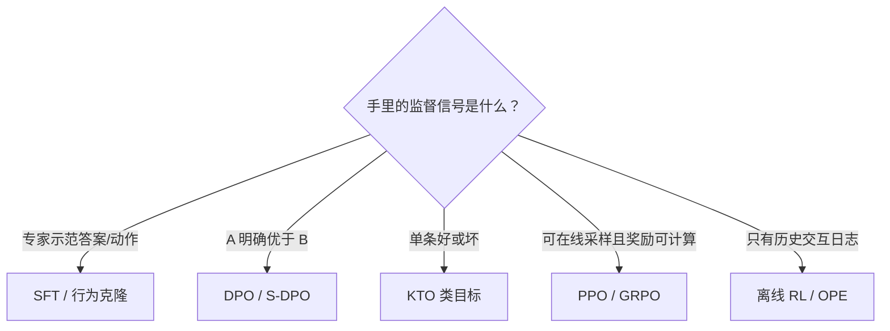

算法不是越新越好。数据形态、反馈偏差、能否交互和计算预算，通常比论文年份更能决定
方案是否合适。

### 6.1 RLHF 三段式：ChatGPT 是怎么“教出来”的

```text
1. SFT：用人工写的好答案先微调模型（模仿）
2. 奖励模型：让人给“哪个回答更好”打分，训练一个打分器
3. PPO：用打分器当奖励，RL 优化策略
```

这是 InstructGPT/RLHF 的经典流程。推荐系统可以类比：SFT ≈ 行为克隆，奖励模型 ≈
用户偏好打分器，PPO ≈ 策略优化。但两者不能直接画等号：推荐日志受曝光策略影响、
奖励延迟且用户状态会变化；LLM 偏好数据通常围绕同一提示比较回答。项目的 offline RL
只对应“不能在线任意探索、必须从日志学习”这一部分约束。

```text
示范数据 ──SFT──► 初始策略 ──生成候选──► 人类偏好 ──► 奖励模型
                     ▲                                  │
                     └──────── PPO + KL 更新 ───────────┘
```

KL 约束的作用是把策略拴在初始/SFT 模型附近：奖励模型只是人类偏好的近似器，跑得太远
容易钻奖励漏洞（reward hacking）。

### 6.2 DPO：省掉奖励模型的“直接偏好优化”

RLHF 要训奖励模型 + 在线采样，重。DPO 发现：**最优策略可以闭式解出来**，于是
只需要“偏好对”（A 比 B 好）直接训练：

```text
loss = −log σ( β·(log π(y_win|x) − log π_ref(y_win|x)
              − log π(y_lose|x) + log π_ref(y_lose|x)) )
```

大白话：让“赢的答案”概率相对参考上升、“输的答案”相对下降。不需要奖励模型，
不需要在线采样，一个分类损失搞定。

公式不要整段死背，把它折叠成一个“相对优势差”：

```text
赢者提升 = log π(win|x)  − log π_ref(win|x)
输者提升 = log π(lose|x) − log π_ref(lose|x)

DPO 希望：赢者提升 − 输者提升 > 0
```

参考模型不是只给一个固定答案，而是定义“相对训练前改变了多少”。`β` 控制这种相对
偏好的尺度。DPO 省掉了显式奖励模型和训练期间的 on-policy rollout，但仍需要质量可靠
的偏好对，也仍可能过拟合偏好数据或放大标注偏差。

### 6.3 KTO：只有“好/坏”也能对齐

现实里很多反馈不是成对比较，而是“这个行、那个不行”（点击/跳过就是）。KTO 用
前景理论做损失，只有二元信号也能训。推荐里的点击/跳过可以用来构造这种反馈，
但不能未经曝光偏差校正就直接画成“点击 = 真喜欢、跳过 = 真不喜欢”。

这里要加一个推荐系统特有的刹车：**没曝光不等于不喜欢，曝光后没点击也可能是位置、
封面或当时没空。** 因此 click/skip 不是天然无偏的好/坏标签。训练前要保留曝光位置、
候选集合和行为倾向分，必要时用 IPS/SNIPS 或随机探索校正；否则 KTO 只会更用力地
复现旧策略的曝光偏差。

### 6.4 SimPO / ORPO：更省

- SimPO：免参考模型，用“平均 log 概率”当隐式奖励 + 目标裕度。
- ORPO：SFT 和偏好对齐一步完成（odds ratio）。

一句话总结：**DPO 家族 = 把 RLHF 的“奖励模型 + PPO”改写成直接偏好损失**。
它们不是按年份排列的“越来越好”：有的省参考模型，有的合并 SFT，有的改变长度
归一化，本质是把成本和假设移动到不同位置。

更准确地说，“省计算”只是选择它们的一个理由，数据是否匹配才是第一关：

| 方法 | 最小数据单元 | 需要参考模型 | 需要在线采样 | 主要风险 |
|---|---|:---:|:---:|---|
| DPO | `(上下文, 赢者, 输者)` | 是 | 否 | 偏好对噪声、长度/曝光偏差 |
| KTO | `(上下文, 输出, 好/坏)` | 是 | 否 | 二元标签噪声和类别失衡 |
| SimPO | 偏好对 | 否 | 否 | 裕度与长度归一化需调 |
| ORPO | SFT 文本 + 偏好对 | 否 | 否 | 把模仿与偏好目标耦合 |
| GRPO | 同输入多条采样 + 可算奖励 | 常用 | 是 | 生成成本、奖励漏洞、组内无差异 |

### 6.5 GRPO/R1：规则奖励 + 组内相对（见第 5.8 节）

DeepSeek-R1 路线的关键是一个组合：**尽量使用可规则验证的奖励**（例如答案是否正确）、
GRPO 组内相对优势，以及多阶段训练。对推荐的启示不是“点击就是正确答案”，而是
优先使用定义清楚、可审计的反馈，并承认代理指标的噪声：点击是客观记录到的行为，
但仍受曝光位置、标题封面和场景影响；模型预测的满意度则又多一层模型误差。

### 6.6 推荐 × 对齐：正在发生的融合

- Softmax-DPO（S-DPO）：把 DPO 推广到推荐的多负样本排序（NeurIPS 2024）。
- Rank-GRPO：用 GRPO 做会话推荐排序对齐（2025）。
- LLM4Rec：LLM 当推荐器的判别/生成两大范式。
- 项目路线：反馈闭环采的真实 click/skip 偏好对 → 未来做 KTO/S-DPO 重排。

> 项目现状：50 篇论文调研在 `notes/14`；GRPO 已在工具门控落地；
> DPO/KTO 重排是计划中的 Phase C。

从本项目走到偏好优化，正确的数据链应该是：


这张图里最关键的不是损失函数，而是训练前的日志完整性与训练后的决策门槛。没有
候选、曝光概率和支持集检查，再漂亮的对齐损失也无法把相关性当成因果提升。

#### 前沿连接：Agentic Recommendation 不只是“让 LLM 写推荐理由”

2026 年的 Agentic Recommender Systems 路线图把研究分成三类：Agent 帮助已有推荐
系统、Agent 自己担任推荐器、Agent 充当用户模拟器。三者的自主性和风险完全不同。

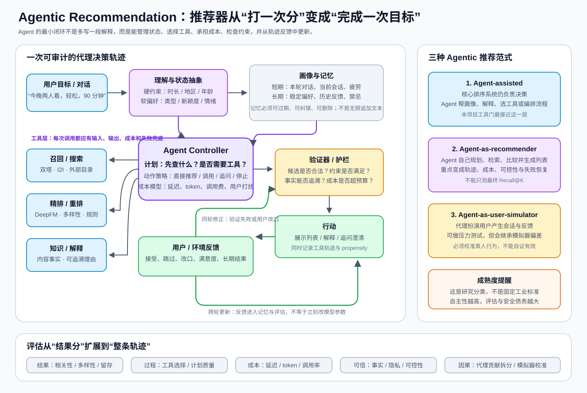

沿图从左到右看，一次完整的 agent 轨迹至少包含：

1. **目标理解**：把“今晚轻松看一部”拆成硬约束和软偏好，而不是直接搜关键词；
2. **记忆管理**：短期会话和长期画像分开，允许过期、纠错和删除；
3. **计划与工具选择**：决定直接回答、调用召回/排序/知识工具，还是先追问用户；
4. **验证与行动**：检查候选合法性、事实来源、成本预算和业务护栏后再展示；
5. **轨迹反馈**：记录用了什么工具、花了多少成本、用户怎样回应，再做归因。

这也是本项目 `research_v3/agentic_rec` 的正确定位：当前只有“原始 SASRec / 疲劳重排”
两个工具动作和显式调用成本，更接近图右侧的 **agent-assisted recommendation**，还不
是一个能够自由规划、多轮对话、长期记忆的完整推荐 Agent。把边界说清楚，比把一个
二分类门控包装成“智能体”更有说服力。

评估也必须从最终 Recall/NDCG 扩展到轨迹：工具是否选对、额外延迟和调用费、失败能否
恢复、解释能否追溯、记忆是否侵犯隐私，以及用户模拟器是否与真人校准。2026 路线图
特别指出轨迹级评估、Agent 贡献拆分和用户模拟校准仍是开放问题，所以这一方向应当
标为**前沿研究框架**，而不是成熟工业标准。
[Agentic Recommender Systems roadmap, 2026](https://arxiv.org/abs/2607.04433)

### 📖 小白补充：动手想一遍（偏好优化）

1. **DPO 在做什么**：给你一对 (赢, 输)，比如“推《教父》→ 点击”“推某动画 →
   跳过”。目标：让“赢”的概率相对参考上升、“输”的相对下降。不用训练奖励模型，
   一个分类损失直接改策略——这就是它比 RLHF 轻的原因。
2. **KTO 和 DPO 的区别**：DPO 要成对比较（A 比 B 好）；KTO 只要单个“好/坏”标签。
   项目的 click/skip 在记录完整曝光与倾向分、处理位置和选择偏差后，可以构造 KTO
   输入；不能把所有未点击物品直接当成用户不喜欢。
3. **S-DPO 和推荐的关系**：把 DPO 从“文本序列”改成“物品排序”——负样本变成
   “没点的那 9 个”，一次用一个正样本 + 多个负样本，比成对更高效、更贴合 Top-K。
4. **KL/参考模型再强调**：DPO 的目标显式比较当前策略与参考策略；原始 GRPO 配方
   常带 KL，但 DAPO 等长推理配方可能移除它。是否需要 KL 取决于奖励是否可靠、允许
   策略偏离多远，不能记成“所有策略优化都必须有”。

### 本章出处与我的笔记

**出处**
- InstructGPT（RLHF 原文）：Ouyang et al., NeurIPS 2022: https://arxiv.org/abs/2203.02155
- DPO：Rafailov et al., NeurIPS 2023: https://arxiv.org/abs/2305.18290
- KTO：Ethayarajh et al., ICML 2024: https://arxiv.org/abs/2402.01306
- SimPO：Meng et al., 2024: https://arxiv.org/abs/2405.14734
- ORPO：Hong et al., EMNLP 2024: https://arxiv.org/abs/2403.07691
- Softmax-DPO（推荐专用）：Yang et al., NeurIPS 2024: https://arxiv.org/abs/2406.09215
- Rank-GRPO：2025: https://arxiv.org/abs/2510.20150
- OneRec（整页生成 + 迭代 DPO）：2025: https://arxiv.org/abs/2502.18965
- DAPO（clip-higher / 动态采样 / 长 CoT 稳定化）：2025: https://arxiv.org/abs/2503.14476
- GSPO（序列级 importance ratio）：2025: https://arxiv.org/abs/2507.18071
- Agentic Recommender Systems 路线图：2026: https://arxiv.org/abs/2607.04433
- 李宏毅 生成式 AI / RLHF 课程: https://speech.ee.ntu.edu.tw/~hylee/ml/2023-spring.php
- Hugging Face TRL 文档（DPO/KTO/GRPO 的实现和超参）: https://huggingface.co/docs/trl/index
- 项目自己的 50 篇文献库：`notes/14-前沿RL论文与落地路线.md`

**深入阅读顺序**：先读 DPO 原文的图解版（网上有很多）→ KTO（因为点击/跳过是二元信号）→ TRL 文档动手跑一个 DPO 小实验 → 再回来看 S-DPO。

**✍️ 我的笔记**

（示例：KTO 只认“好/坏”，感觉比 DPO 更适合我们 feedback_app 采的数据——准备在 Phase C 里先试它。）

### 6.7 本章自测
1. RLHF 三步是哪三步？（答：SFT → 奖励模型 → PPO）
2. DPO 省掉了什么？（答：奖励模型和在线采样，直接偏好对训练）
3. 为什么 KTO 的数据形态接近推荐反馈、但不能直接套？（答：它接受单条好/坏信号，
   但点击/跳过受曝光和位置偏差影响，必须先保留候选、propensity 并做支持集检查）
4. DeepSeek-R1 的“规则奖励”是什么意思？（答：奖励由可验证的规则算，不靠模型打分）
5. 为什么 Agentic 推荐不能只看最终 Recall@K？（答：还要评估工具选择、轨迹质量、
   延迟/调用成本、失败恢复、事实与隐私，以及用户模拟器是否校准）

---

## 第 7 章：面试冲刺

### 7.1 30 秒项目叙事（背下来）

“我在 MovieLens-1M 上从零搭了一条完整的推荐链路：双塔召回（含批内负采样和 logQ
校正）→ DeepFM 精排 → SASRec 序列模型 → 再用冻结的 SASRec 造仿真器，手写了
DQN、策略梯度、PPO 和 GRPO 做会话级强化学习；同时把离线 RL（BC/CQL/IQL）和
真实反馈闭环（IPS/ESS/bootstrap 决策门槛）串起来。所有结论都标注了评估协议，
不跨协议比数字。”

### 7.2 高频问题 → 一句话答案（核心 20 个 + 前沿 4 个）

| 问题 | 一句话答案 |
|---|---|
| 为什么需要召回？ | 全库精排太慢；向量可缓存、点积可批量 |
| 双塔负样本怎么采？ | 批内采样（B×B 矩阵，对角线是正），或随机负采样 |
| 批内采样有什么偏差？ | 候选服从非均匀 q(j) → 打分减 `log q(j)` 校正采样机会 |
| Faiss 近似索引怎么选？ | IVF 分桶、HNSW 图、PQ 压缩；画 Recall vs 延迟曲线 |
| DeepFM 和 Wide&Deep 区别？ | Wide 换成 FM，共享 embedding 自动学交叉 |
| DIN 解决什么问题？ | 用户历史行为对候选的注意力加权（不是等权） |
| 多目标怎么做？ | MMoE（门控专家）/ ESSM（转化漏斗） |
| AUC 有什么问题？ | 会做跨用户比较、混入基础点击率差异 → 组内算 GAUC 并写清聚合权重 |
| 冷启动怎么解？ | 热门兜底 + 特征 + 小流量试探（bandit） |
| A/B 怎么保证可信？ | 用户分桶、层叠实验、检查 SRM、置信区间 |
| RL 和 supervised 区别？ | 前者边交互边学、优化长期回报；后者学静态映射 |
| γ 怎么理解？ | 未来收益打几折；γ=0 短视，γ=1 完全看长期 |
| REINFORCE 缺点？ | 方差大 → 减基线（Actor-Critic）/ GAE |
| PPO 为什么稳？ | clip 限步长 + GAE 压方差 + 复用提效率 |
| GRPO 和 PPO 区别？ | GRPO 无 Critic、用组内相对优势；KL 是否加入取决于具体配方 |
| 离线 RL 怎么防发散？ | CQL 保守 / IQL 免 max / BC 约束；先诊断再选 |
| OPE 是什么？ | 用日志估计新策略价值：IPS/SNIPS + ESS + 置信区间 |
| IPS 的倾向分是什么？ | 每条被展示的概率；用它纠“只看得到被展示的”偏差 |
| 为什么 argmax 部署会塌缩？ | 把随机策略压成单点，反复选略高峰值；采样是否更好要实测 |
| 仿真器结论能上线吗？ | 不能，只是研究证据；上线要走真实反馈门槛 |
| Semantic ID 比普通 item ID 多了什么？ | 多级离散 codeword 共享内容语义，可被自回归生成，但有量化碰撞与解码成本 |
| 生成式推荐会替代召回精排吗？ | 尚不能这样下结论；先和成熟级联同协议比较效果、延迟、更新和回滚能力 |
| DAPO 与 GSPO 各修什么？ | DAPO 修长 CoT 训练失败模式；GSPO 把重要性比与裁剪提到序列级 |
| Agentic 推荐怎么评估？ | 结果 + 工具选择 + 轨迹 + 延迟成本 + 失败恢复 + 隐私/模拟器校准 |

### 7.3 诚实边界话术（面试加分项）

“我每个数字都能说清协议和边界：ML-1M 和 25M 不可比、双塔和 SASRec 协议不同、
仿真器分数不代表线上。CQL 在这个环境里反而不如 naive，我的结论是‘先诊断数据
覆盖再选方法’——这比背一个 SOTA 名字更经得起追问。”

### 7.4 面试前自查清单

- [ ] 能画两段式架构图（召回→排序→重排）
- [ ] 能手推批内 softmax 矩阵和 logQ 公式
- [ ] 能讲清 DeepFM 的 FM 部分在干嘛
- [ ] 能解释 GAUC、NDCG、ESS、IPS
- [ ] 能写 PPO 的 clip 损失公式
- [ ] 能说清 GRPO 相对 PPO 改了哪三处
- [ ] 能用“一句话+为什么”讲本项目任意一个参数

### 本章出处与我的笔记

**出处**
- 《百面机器学习》（诸葛越主编，人民邮电出版社）——搜广推面试题集
- 牛客网 搜广推面经: https://www.nowcoder.com/
- 项目面试手册（项目内）: `docs/INTERVIEW_PLAYBOOK.md`
- 项目证据清单（项目内）: `docs/PROJECT_EVIDENCE.md`
- 30 秒叙事和 20 个高频问答的来源 = 第 1~6 章出处汇总，背熟即可

**✍️ 我的笔记**

（示例：把面试官实际问过我的问题记在这里：______）

---

## 第 8 章：综合自测与动手练习

### 8.1 综合选择题（答案在文末）

1. 双塔召回里，用户向量和电影向量用什么算相似度？
   A. 余弦距离 B. 点积 C. 欧氏距离 D. 交叉熵
2. logQ 校正在修什么？
   A. 过拟合 B. 批内负采样偏差 C. 梯度爆炸 D. 冷启动
3. γ=0 时，优化目标只包含什么？
   A. 即时奖励 B. 全回合奖励 C. 下一状态价值 D. 熵
4. PPO 的 clip 参数 ε=0.2 限制什么？
   A. 学习率 B. 新旧策略概率比的范围 C. 批大小 D. 折扣
5. GRPO 相比 PPO 主要省掉了？
   A. 奖励函数 B. 价值网络 C. 策略网络 D. 经验回放
6. 本项目里 CQL/IQL 打不过 naive DQN，最直接原因？
   A. 代码写错 B. 环境回报有界+动作全合法，OOD 高估灾难不出现
   C. 数据太少 D. 学习率太大
7. ESS 表示什么？
   A. 样本量 B. 有效样本量（权重太偏则小） C. 熵 D. 误差

答案：1B 2B 3A 4B 5B 6B 7B。（提示：第 4、5 题之外，所有题都在考“机制”而不是背数字。）

### 8.2 动手练习（用本项目，每个 10 分钟）

1. **看 γ 的作用**：改 `src/train_dqn_rec.py` 的 `GAMMA=0.9 → 0.3`，跑
   `--steps 3000`，对比 eval 分数——γ 小 = 短视 = 分数掉。
2. **看 clip 的作用**：`train_ppo_rec.py --clip 0.05` vs `--clip 0.5`，看谁更稳。
3. **看 K 的作用**：`research_v3/agentic_rec/train.py --algo grpo --epochs 1`
   vs `--epochs 4`，复现“K=1 约等于 REINFORCE”。
4. **看保守的作用**：`research_v2/phase2_offline_rl/ablation_alpha.py` 扫 α，
   复现“α 越大越短视”。
5. **看 dropout 的作用**：`train_sasrec.py --epochs 5 --dropout 0.5` vs `0.2`，
   看验证集谁好。

### 8.3 结语

这份文档的目标不是让你成为 RL 研究员，而是让你**能看懂项目里的每一个名词、
能向面试官讲清“为什么”，并且知道数字是怎么来的**。学完第 1–5 章，你已经超过
大多数只会调包的人；学完第 7 章，你能把这套东西讲成故事。遇到不懂的，回项目
代码里找实物，比再看一遍课件有效得多。

祝你学得开心——学完这 8 章，回来把第 0.3 节的速查索引全部打勾，就算毕业了。

### 本章出处与我的笔记

**出处**：综合第 1~7 章来源；动手练习直接对应项目脚本：
- γ 实验：`src/train_dqn_rec.py`（`GAMMA`）
- clip 实验：`src/train_ppo_rec.py`（`--clip`）
- K 实验：`research_v3/agentic_rec/train.py`（`--algo grpo --epochs`）
- α 实验：`research_v2/phase2_offline_rl/ablation_alpha.py`
- dropout 实验：`src/train_sasrec.py`（`--dropout`）

**✍️ 我的笔记**

（示例：练习 1 做完了——γ=0.3 时 DQN 最后只能拿 5 分左右，直观看到“短视”的代价。）

---

## 第 9 章：名词速查词典（60+ 个术语 → 大白话）

### 9.1 数据与评估

| 名词 | 大白话 | 章节 |
|---|---|---|
| leave-one-out | 每个用户最后一次交互当考题，前面的当历史 | 1 |
| 负采样 | 1 个真目标 + N 个随机陪跑一起排序 | 2 |
| 训练/验证/测试集 | 练习册 / 模拟考 / 期末考 | 2 |
| 过拟合 | 背答案背得好，考试露馅 | 2 |
| 正则化 L2 | 罚参数别太极端 | 2 |
| AUC | 随机正样本排在随机负样本前的概率；0.5 是随机排序 | 2 |
| GAUC | 用户内算 AUC 再等权或加权聚合；必须注明权重口径 | 2,4 |
| HR@K | 正确答案在不在前 K | 2 |
| NDCG@K | 还要看排多靠前、越靠前加权越大 | 2 |
| Recall@K | 对的里面召回的比例 | 2,4 |
| 协议 | 考试的规则（怎么切题、怎么算分），必须一致才能比数字 | 0,2 |
| 消融 | 一次只改一个变量，看它贡献多少 | 0 |
| bootstrap | 反复抽样本算置信区间 | 1,4 |
| 置信区间 | 重复抽样时按固定方法构造、长期以给定比例覆盖真值的区间 | 1,4 |
| 偏差-方差 | 打偏 vs 打飘；过拟合=低偏差高方差 | 1 |

### 9.2 模型与表示

| 名词 | 大白话 | 章节 |
|---|---|---|
| embedding | 把 ID 变成稠密向量（口味坐标） | 3 |
| one-hot | 只有一个 1 的超长稀疏向量 | 3 |
| MLP | 多层神经元叠起来的网络 | 3 |
| ReLU / Sigmoid / Tanh | 激活函数：引入非线性 / 变概率 / 压到 −1~1 | 3 |
| LayerNorm | 对单个样本的隐藏维做归一化，训练更稳 | 3 |
| dropout | 训练时随机关神经元防过拟合 | 3 |
| 梯度裁剪 | 梯度太大就按比例缩小 | 3 |
| 残差连接 | 让深层网络好训练：输出 = 输入 + 变换 | 3 |
| 自注意力 | 每个位置按“相关度”加权汇总其他位置 | 3 |
| Q/K/V | 查询/键/值，注意力三件套 | 3 |
| 因果掩码 | 只能看过去不能看未来 | 3 |
| 多头注意力 | 多组 QKV 并行学不同类型关系 | 3 |
| 位置编码 | 告诉模型“这是第几个” | 3 |
| LR | 线性模型过 sigmoid 变概率 | 2 |
| FM | LR + 二阶交叉项，学特征两两组合 | 2,4 |
| Wide&Deep | 一路记忆 + 一路泛化 | 4 |
| DeepFM | Wide 换成 FM，共享 embedding | 4 |
| DIN | 历史行为按注意力加权（不是等权） | 4 |
| DIEN | 用 GRU 建模兴趣演化 | 4 |
| MMoE | 多个专家 + 门控，多任务共享 | 4 |
| ESSM | 转化漏斗：转化 = 点击 × 购买 | 4 |

### 9.3 召回与检索

| 名词 | 大白话 | 章节 |
|---|---|---|
| 双塔 | 用户塔/物品塔各出向量，点积当分数 | 4 |
| in-batch softmax | 一个 batch 里互相当负样本的 B×B 打分 | 4 |
| logQ 校正 | 打分减 `log q(j)`，校正候选采样机会不均 | 4 |
| 温度 T | softmax 的尖锐度旋钮 | 3,4 |
| 多路召回 | U2I / I2I / 热门 / 语义多路并召回再融合 | 4 |
| Faiss | 向量检索库 | 4 |
| ANN / IVF / HNSW / PQ | 近似检索：分桶 / 图 / 压缩 | 4 |
| Semantic ID | 把一个物品表示成多级离散语义 codeword，而非随机原子 ID | 4 |
| RQ-VAE | 逐级量化“上一层剩余误差”，生成 Semantic ID | 4 |
| 生成式检索 | 不查 ANN，直接自回归生成目标物品的标识符 | 4 |
| session-wise generation | 一次生成整组推荐，直接建模列表内部依赖 | 4,6 |
| 冷启动 | 新用户新物品没历史怎么办 | 4 |
| bandit / LinUCB / ε-greedy | 边推边学：上置信界 / 随机探索 | 4 |
| Thompson Sampling | 按后验采样决定探索哪条臂 | 4 |

### 9.4 强化学习

| 名词 | 大白话 | 章节 |
|---|---|---|
| MDP | 状态+动作+奖励+转移的决策框架 | 5 |
| 状态 s / 动作 a / 奖励 r | 看到什么 / 做什么 / 拿多少分 | 5 |
| 策略 π(a\|s) | 看到 s 选 a 的概率 | 5 |
| 折扣 γ | 未来打几折；越小越短视 | 5 |
| 回报 G | 从某步开始的所有折扣奖励之和 | 5 |
| V(s) / Q(s,a) | 状态价值 / 状态动作价值 | 5 |
| Bellman 方程 | 当前价值 = 即时奖励 + 折扣 × 下一步价值 | 5 |
| 策略梯度 | 让高回报动作概率上升 | 5 |
| REINFORCE | 最朴素的策略梯度（整回合回报当老师） | 5 |
| Actor-Critic | 动作网络 + 价值基线 | 5 |
| 优势 A | 实际回报比平均水平好多少 | 5 |
| GAE | λ 滑动条，折中偏差和方差 | 5 |
| DQN | 学 Q 值选最大动作 + 回放 + 目标网络 | 5 |
| 经验回放 | 历史样本缓冲池随机采样 | 5 |
| 目标网络 | 慢更新的 Q，防自我教自我震荡 | 5 |
| Double DQN | 在线网选动作、目标网估值，去 max 偏差 | 5 |
| PPO | clip + 重要性比 + 多轮复用 + GAE | 5 |
| clip | 概率比超出 `[1−ε,1+ε]` 后，不再让代理目标继续奖励过猛更新 | 5 |
| 熵正则 | 奖励策略保持随机、别过早固化 | 5 |
| GRPO | 无 Critic，用组内相对奖励估优势；常配 clip，KL 取决于具体配方 | 5,6 |
| 组内相对优势 | 一组采样互相比较谁更好 | 5 |
| DAPO | 针对长 CoT 的 GRPO 工程修复：clip-higher、动态采样等 | 5,6 |
| GSPO | 用序列似然而非单 token 定义 importance ratio 和 clip | 5,6 |
| KL 正则 | 惩罚策略跑偏参考太远 | 5,6 |
| 参考模型 | 用来定义“训练后偏离了多少”的冻结策略，常由 SFT/初始策略复制 | 5,6 |
| 离线 RL | 只用历史日志训练，不能交互 | 5 |
| BC / RWR | 纯模仿 / 给高回报样本加权 | 5 |
| return-to-go | 从结尾倒推的折扣总回报 | 5 |
| 外推误差 | max 会挑中没见过的动作、高估放大 | 5 |
| CQL | 保守项压低 OOD 的 Q（α 控强度） | 5 |
| IQL | 免 max，用 expectile 的 V 替代 | 5 |
| Decision Transformer | 把离线 RL 变回报条件序列建模 | 5 |
| argmax 塌缩 | 把随机策略压成单点后反复选同一峰值；采样与否需按部署指标验证 | 5 |

### 9.5 评估、反馈与对齐

| 名词 | 大白话 | 章节 |
|---|---|---|
| OPE | 用日志估新策略价值（离线版 A/B） | 4,5 |
| IPS | 用倾向分 1/p 加权，纠“只看得到被展示的”偏差 | 4 |
| SNIPS | IPS 的归一化版本，更稳 | 4 |
| propensity | 每条被展示的真实概率 | 4 |
| ESS | 有效样本量；权重太偏就小，小则不可信 | 4 |
| 覆盖率 | 展示的物品里确认曝光的比例 | 4 |
| 影子部署 | 线上跑 A，同时偷偷算 B 会怎样 | 4 |
| RLHF | SFT → 奖励模型 → PPO 三段式 | 6 |
| DPO | 免奖励模型，偏好对直接训练 | 6 |
| KTO | 用单条好/坏标签对齐；推荐日志需先处理曝光偏差 | 6 |
| SimPO / ORPO | 免参考模型 / 单阶段对齐 | 6 |
| S-DPO | 推荐专用的多负样本 DPO | 6 |
| 规则奖励 | 由可验证规则算奖励（R1 的关键） | 6 |
| LLM4Rec | 用 LLM 做推荐（判别/生成） | 6 |
| Agentic Recommendation | 用记忆、计划、工具和反馈轨迹完成推荐目标 | 6 |
| tool gate | 在收益与成本之间决定本步是否调用某个工具 | 6 |
| 轨迹评估 | 不只看结果，还看每一步工具、成本、错误与恢复 | 6 |

### 9.6 工程与系统

| 名词 | 大白话 | 章节 |
|---|---|---|
| 两段式架构 | 召回（快粗）→ 精排（慢准） | 4 |
| 特征工程 | 给模型准备的原料（ID/属性/统计/序列） | 4 |
| 在线学习 / 增量更新 | 线上实时/定时更新模型 | 4 |
| A/B 分流 | 用户分桶对比实验 | 4 |
| 层叠实验 | 流量被多层实验复用 | 4 |
| SRM | 实验组样本流失不均，结论不可信 | 4 |
| 服务化 / 压测 | 把模型包成 API、测容量 | 4 |
| 优雅停机 / 探针 | 服务退出不留脏数据 / 健康检查 | 4 |

---

### 9.7 重要名词详解（20+ 个重点词，每个都有例子）

> 快速表在 9.1–9.6；这里是“想真正理解”的精读版：每个词 = 一句话定义 + 大白话
> 详解 + 例子/类比 + 项目对照。

**1. embedding**：一句话 = 把 ID 变成一串可训练数字。详解 = 每个用户/电影学一个
短向量；训练目标若要求两个对象在相似上下文中得到相似预测，梯度才会把它们调近，
不是“共现就必然靠近”。项目 = 双塔 32 维向量、SASRec 的 `nn.Embedding`。

**2. 点积**：一句话 = 对应位相乘再相加。详解 = 点积同时受向量长度和夹角影响；
两边 L2 归一化后才等于余弦相似度。项目 = 双塔先 `F.normalize`，再算用户向量·电影
向量，Faiss 找最大点积。

**3. softmax 与温度**：一句话 = 把分数变成概率的开关。详解 = 指数化后归一，
温度 T 越小分布越尖锐（几乎只押最高分）。项目 = 双塔 `TEMP=0.05` 让排序更自信。

**4. 交叉熵**：一句话 = 分类的“错得有多离谱”的度量。详解 = 真标签是 1 却预测
0.1，损失高达 2.3；预测 0.9 只有 0.1——自信犯错最痛。项目 = 双塔/DeepFM/BC
的损失。

**5. AUC 与 GAUC**：一句话 = 随机抽正负各一个时，正样本排前的概率。详解 =
0.5 是随机排序、1.0 是全排对；GAUC 按用户分组后加权或平均，减少用户样本量差异
带来的偏移。AUC 不等于概率校准或 Top-K 质量，也没有通用上线阈值。项目 = DeepFM
0.754；解读时必须带上当前数据和划分协议。

**6. 过拟合与正则化**：一句话 = 背答案 vs 真学会。详解 = 训练好考试差就是过拟合；
L2 罚参数别太极端、dropout 随机缺勤、验证集选优都是解药。项目 = 矩阵分解 loss
降 Recall 崩的翻车案例。

**7. 双塔**：一句话 = 用户塔+物品塔各出向量，点积当相似度。详解 = 两塔独立缓存
向量，全库检索毫秒级，所以适合召回。项目 = `train_two_tower.py`。

**8. in-batch softmax**：一句话 = 一个 batch 里互相当负样本。详解 = B×B 打分矩阵，
对角线是正样本，交叉熵逼它赢过其它 B−1 个。项目 = 双塔训练方式。

**9. logQ 校正**：一句话 = 修候选采样概率 `q(j)` 不均。详解 = 批内候选来自训练
物品分布而非全库均匀分布；打分减 `log q(j)`，稀有候选得到更大的机会补偿，抵消
热门候选的过度代表。项目 = `logits = u@it.T/TEMP − log_q`。

**10. ANN / IVF / HNSW**：一句话 = 近似找最近邻，快但可能漏。详解 = IVF 分桶只搜
几个桶，HNSW 走图跳着搜，PQ 压缩向量；和暴力检索做“Recall vs 延迟”权衡。
项目 = 目前只有暴力 `IndexFlatIP`，近似索引是已列下一步。

**11. DeepFM 与 FM**：一句话 = 自动学特征两两交叉的经典 CTR 架构。详解 = FM
用两个向量的点积表示交叉权重，解决稀疏特征交叉难学；DeepFM 再加深度网络学
非线性。项目 = 在已评分正向偏好 proxy 上 AUC 0.754，不是真实 CTR。

**12. DIN**：一句话 = 用户历史行为按注意力加权。详解 = 候选是《教父》时，历史里
黑帮片的权重更高，不是所有历史等权。项目 = 未实现，是排序侧最大面试缺口。

**13. MMoE**：一句话 = 多任务多专家的门控融合。详解 = 点击/时长/转化各自要学，
多个专家网络 + 门控决定每个任务用谁。项目 = 未实现。

**14. 冷启动**：一句话 = 没历史的新用户/新物品怎么推。详解 = 热门兜底、统计特征、
小流量试探（bandit）。项目 = bandit 实验就是边推边学。

**15. A/B 与 SRM**：一句话 = 分桶对比实验 + 检查样本流失是否失衡。详解 = 用户
哈希分桶同时跑新旧策略；实验组流失比例差太多（SRM）结论不可信。项目 = 反馈闭环
的 IPS/ESS/置信区间是它的离线版。

**16. MDP 与 γ**：一句话 = 状态/动作/奖励/转移的决策框架 + 未来打几折。详解 =
γ=0.9 明天打九折，γ 越小越短视。项目 = `RecSimEnv` + `GAMMA=0.9`。

**17. 回报与 V/Q**：一句话 = 从某步起能拿的总折扣奖励 / 状态价值 / 状态动作价值。
详解 = V(s) 是“从这状态出发平均能拿多少”，Q(s,a) 是“先做 a 能拿多少”。
项目 = DQN 学 Q，Actor-Critic 学 V 当基线。

**18. 策略梯度**：一句话 = 让正优势动作概率上升、负优势动作概率下降。详解 =
梯度 ≈ 优势 × log 概率的梯度；原始回报方差大，所以常减 V(s) 基线。项目 =
`train_pg_rec.py`。

**19. PPO 与 clip**：一句话 = 限制每步更新幅度的策略梯度。详解 = 新旧概率比 r
超出 ±ε 就截断，防止一步改太猛。项目 = `train_ppo_rec.py`，ε=0.2。

**20. GRPO 与组内优势**：一句话 = 不要价值网络，一组采样互比当优势。详解 = 同一
状态采 4 条，组内标准化得优势，第一名多学；配 KL 防跑偏。项目 = agentic 工具门控，
K=4 实测 +4.8%。

**21. 离线 RL 与外推误差**：一句话 = 只用日志训练 + max 会挑中没见过动作的高估。
详解 = Bellman 的 max 会选“看起来最高”的幻觉动作，自举放大。项目 = 离线 RL 全部
围绕它展开。

**22. CQL 与 IQL**：一句话 = 保守压 OOD vs 干脆不用 max。详解 = CQL 加保守项，
α 控强度；IQL 用 expectile 的 V 替代 max。项目 = 两者都被拉回行为策略（3.63/3.35），
naive 反而 9.43——先诊断再选药。

**23. IPS 与 ESS**：一句话 = 倾向分纠偏 + 有效样本量把关。详解 = 每条被展示的
真实概率 1/p 加权，修“只能看到被展示的”偏差；权重太偏（ESS 小）结论不可信。
项目 = 反馈闭环评估地基。

**24. bootstrap 置信区间**：一句话 = 用重采样近似估计量的不确定性。详解 = 从样本
有放回重采样多次，每次重算策略差异，再取分位数；区间跨 0 表示当前数据不能稳定
排除“无提升”。覆盖率是重复实验意义，不是本次固定区间的主观概率。项目 = 决策
门槛的一部分。

**25. DPO 与 KTO**：一句话 = 偏好对直接训练 vs 单条好/坏标签训练。详解 = DPO 要
(赢,输) 对；KTO 只要“好/坏”。点击/跳过可构造 KTO 数据，但必须保留曝光位置、
候选和倾向分并处理选择偏差，未曝光不能当负例。项目 = Phase C 候选。

**26. KL 与参考模型**：一句话 = 衡量并可惩罚“偏离参考策略多远”。详解 = 参考通常
由训练前/SFT 策略冻结得到；偏好奖励噪声大时，KL 是防奖励漏洞的护栏，但可验证推理
配方可能允许更大偏离甚至移除 KL。项目 = GRPO β=0.04、DPO 的参考项；不是所有
策略优化的必选项。

**27. Semantic ID 与生成式检索**：一句话 = 把物品变成可逐 token 生成的语义编码。
详解 = 内容编码器先产连续向量，RQ-VAE 再逐级量化残差得到 `(c1,c2,c3,...)`；TIGER
让 Transformer 根据用户历史生成下一物品编码。它把 ANN 搜索换成了解码，但新增码本
碰撞、Beam 延迟和索引更新问题。项目 = 当前尚未实现，应先和双塔/SASRec 同协议比较。

**28. DAPO 与 GSPO**：一句话 = 一个修长 CoT 训练失败模式，一个改变 importance
ratio 的粒度。详解 = DAPO 用 clip-higher、动态采样、token 级 loss 和过长奖励塑形；
GSPO 用序列似然比做 sequence-level clip。它们针对的 bug 不同，不能合并记成“新版
GRPO”。项目 = 二动作工具门当前没有长文本截断问题，只适合借鉴零优势组和熵诊断。

**29. Agentic Recommendation**：一句话 = 推荐器不仅打分，还能维护状态、规划并选择
工具完成用户目标。详解 = agent-assisted 只增强已有系统；agent-as-recommender 自己
编排完整轨迹；agent-as-user-simulator 用代理模拟反馈。自主性越高，越要评估成本、
失败恢复、隐私和模拟器校准。项目 = 当前工具门属于第一类的最小实验。

**30. tool gate 与轨迹评估**：一句话 = 先判断“调用是否值得”，再检查整条决策过程。
详解 = 工具可能提高相关性，也增加延迟、费用和失败点；奖励应写成用户收益减调用成本，
评估同时看工具选择、最终结果、资源消耗和反事实基线。项目 = 规则 gain gate 仍优于
学习门，说明可解释的成本收益规则本身就是强基线。

### 9.8 词典使用建议

遇到不懂的词三步走：
1. 先看本表的大白话（30 秒）；
2. 翻到对应章节读原理（5 分钟）；
3. 回项目代码里找实物，把数字念一遍（5 分钟）。

这样每个词过三遍，比刷十遍课件都牢。

### 本章出处与我的笔记

**出处**：词条全部来自第 1~8 章对应的课程/书/论文；每条后的“章节”列就是出处。
想追根溯源，点开对应章节的「本章出处与我的笔记」即可。

**✍️ 我的笔记**

（示例：把面试官问过但我答不上来的词加到这里：______）

## 第 10 章：全部出处总表

> 一份能直接收藏的清单。课程和书按推荐顺序排；论文按主题排，都是官方/权威链接。

### 10.1 课程（视频）

| 课程 | 覆盖章节 | 链接 |
|---|---|---|
| 3Blue1Brown《线性代数的本质》 | 第 1 章 | https://www.3blue1brown.com/topics/linear-algebra |
| 3Blue1Brown《微积分的本质》 | 第 1 章 | https://www.3blue1brown.com/topics/calculus |
| 吴恩达《机器学习》 | 第 1、2 章 | https://www.coursera.org/learn/machine-learning |
| 吴恩达《深度学习专项》 | 第 3 章 | https://www.coursera.org/specializations/deep-learning |
| 李沐《动手学深度学习》（d2l） | 第 1、2、3、4 章 | https://zh.d2l.ai/ |

> 用途：看论文/面经/项目代码时遇到不懂的词，直接来这查。每行都给了对应章节，
> 想深挖就翻回去。

| 斯坦福 CS231n | 第 3 章（反向传播） | http://cs231n.stanford.edu/ |
| 周博磊《强化学习纲要》 | 第 5 章 | https://github.com/zhoubolei/introRL |
| 李宏毅 机器学习/RL 课程 | 第 5、6 章 | https://speech.ee.ntu.edu.tw/~hylee/ml/2023-spring.php |
| EasyRL《动手学强化学习》 | 第 5 章 | https://github.com/datawhalechina/easy-rl |

### 10.2 书

| 书 | 覆盖章节 | 链接 |
|---|---|---|
| 《程序员的数学 2：概率统计》（结城浩） | 第 1 章 | 各大书店 |
| 李航《统计学习方法》 | 第 2 章 | https://book.douban.com/subject/10590856/ |
| 周志华《机器学习》（西瓜书） | 第 2 章 | https://book.douban.com/subject/26708119/ |
| 项亮《推荐系统实践》 | 第 4 章（入门） | https://book.douban.com/subject/10769749/ |
| 王喆《深度学习推荐系统》 | 第 4 章（工业全链路） | https://book.douban.com/subject/35501888/ |
| Sutton & Barto《强化学习导论》第二版（免费 PDF） | 第 5 章 | http://incompleteideas.net/book/the-book-2nd.html |
| 《百面机器学习》（诸葛越） | 第 7 章 | 各大书店 |
| Kohavi《Trustworthy Online Controlled Experiments》 | 第 4 章（A/B） | https://www.amazon.com/Trustworthy-Online-Controlled-Experiments-Practical/dp/1108724267 |

### 10.3 核心与前沿论文（按主题）

**召回与双塔**
- YouTube DNN（Covington 2016）: https://research.google/pubs/pub45530/
- Sampling-Bias-Corrected Neural Modeling（Yi 2019，logQ 出处）
- Faiss（Johnson 2017）: https://arxiv.org/abs/1702.08734
- HNSW（Malkov & Yashunin 2018）: https://arxiv.org/abs/1603.09320

**排序与 CTR**
- Wide&Deep（2016）: https://arxiv.org/abs/1606.07792
- DeepFM（2017）: https://arxiv.org/abs/1703.04247
- DIN（2018）: https://arxiv.org/abs/1706.06978
- DIEN（2019）: https://arxiv.org/abs/1809.03672
- MMoE（2018）: https://arxiv.org/abs/1708.05122
- ESSM（2018）: https://arxiv.org/abs/1804.07931
- FM（Rendle 2010）: https://dl.acm.org/doi/10.1109/ICDM.2010.127

**序列推荐与 Transformer**
- Transformer（2017）: https://arxiv.org/abs/1706.03762
- SASRec（2018）: https://arxiv.org/abs/1808.09781

**生成式推荐**
- TIGER / Semantic ID 生成式检索（NeurIPS 2023）: https://arxiv.org/abs/2305.05065
- OneRec / 整页生成与偏好对齐（2025）: https://arxiv.org/abs/2502.18965
- GRID / Semantic ID 开源消融框架（2025）: https://arxiv.org/abs/2507.22224
- Semantic ID 规模瓶颈研究（2025）: https://arxiv.org/abs/2509.25522

**强化学习**
- DQN（2015）: https://arxiv.org/abs/1312.5602
- Double DQN（2016）: https://arxiv.org/abs/1509.06461
- GAE（2016）: https://arxiv.org/abs/1506.02438
- PPO（2017）: https://arxiv.org/abs/1707.06347
- GRPO/DeepSeekMath（2024）: https://arxiv.org/abs/2402.03300
- DeepSeek-R1（2025）: https://arxiv.org/abs/2501.12948
- DAPO（2025）: https://arxiv.org/abs/2503.14476
- GSPO（2025）: https://arxiv.org/abs/2507.18071

**离线 RL**
- 离线 RL 综述（Levine 2020）: https://arxiv.org/abs/2005.01643
- CQL（2020）: https://arxiv.org/abs/2006.04779
- IQL（2021）: https://arxiv.org/abs/2110.06169
- Decision Transformer（2021）: https://arxiv.org/abs/2106.01345

**偏好对齐与 LLM**
- InstructGPT/RLHF（2022）: https://arxiv.org/abs/2203.02155
- DPO（2023）: https://arxiv.org/abs/2305.18290
- KTO（2024）: https://arxiv.org/abs/2402.01306
- SimPO（2024）: https://arxiv.org/abs/2405.14734
- ORPO（2024）: https://arxiv.org/abs/2403.07691
- Softmax-DPO（2024）: https://arxiv.org/abs/2406.09215
- Rank-GRPO（2025）: https://arxiv.org/abs/2510.20150
- Agentic Recommender Systems 路线图（2026）: https://arxiv.org/abs/2607.04433

### 10.4 项目内资料（对照用）

- 50 篇文献库与落地路线：`notes/14-前沿RL论文与落地路线.md`
- Agentic 工具门控笔记：`notes/13-Agentic推荐-主动工具调用.md`
- 离线 RL 与 SFT 笔记：`notes/12-推荐系统后训练-离线RL与SFT.md`
- 总报告：`REPORT.md`
- 面试手册：`docs/INTERVIEW_PLAYBOOK.md`
- 证据清单：`docs/PROJECT_EVIDENCE.md`
