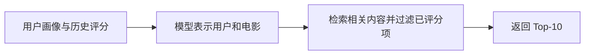

# 15 分钟上手：视频 / 内容推荐

先跑一次推荐，再看页面、模型和反馈怎样连接。当前使用 MovieLens 电影评分数据实现内容推荐原型。

## 1. 跑出一组推荐

进入 `recsys-learning` 仓库根目录，在 PowerShell 中执行：

```powershell
.venv/Scripts/python.exe -m streamlit run app.py
```

在浏览器打开 [本地 Demo](http://localhost:8501)。选择用户 1，先保持默认的“双塔 Top-K”策略。

- 左边看这个用户历史上给过高分的电影。
- 右边看系统推荐的 10 部电影。
- 换一个用户，观察推荐结果怎样变化。

这就是本项目当前能直接展示的用户流程。页面使用 Streamlit，推荐逻辑在独立的 Python 模块里。
现有环境已经有数据和权重；新克隆缺少这些文件时，按 [完整复现指南](docs/MOVIELENS_GUIDE.md) 准备。

## 2. 理解结果怎样产生



**双塔**：分别把用户与电影表示成一串数字，用它们的相似程度匹配内容。
**Faiss**：负责对这些数字向量做检索。当前使用精确内积检索。
**Top-K**：从候选中返回前 K 个结果，这里默认展示 10 个。

当前默认直接采用双塔的顺序。DeepFM 精排保留作研究对照，因为已有端到端实验没有证明它能改善这条推荐链路。

## 3. 按应用开发的顺序读代码

| 想看懂什么 | 先打开哪里 |
|---|---|
| 用户怎样选择、页面怎样显示结果 | [app.py](app.py) |
| 怎样加载模型、检索内容并返回结果 | [src/serving.py](src/serving.py) 的 `Recommender` |
| 怎样通过 HTTP 调用推荐功能 | [serve.py](serve.py) 的 `/recommend` 接口 |
| 怎样记录曝光与用户反馈 | [src/feedback.py](src/feedback.py) |

页面和 HTTP API 都复用同一份推荐核心。现有 Streamlit 页面直接调用 Python 核心；独立前端可以通过 HTTP API 接入。
第一遍理解输入、输出和调用关系即可，训练公式留到对应章节再看。

## 4. 体验反馈流程（可选）

反馈实验台是另一个入口。在第二个终端运行：

```powershell
.venv/Scripts/python.exe -m streamlit run feedback_app.py --server.port 8502
```

打开 [反馈实验台](http://localhost:8502)，按页面提示选择自己想看的电影。
系统记录这一批展示了什么、你选择了什么，并把记录保存到本地数据库，供后续回放与评估。
反馈操作与普通推荐 Demo 分开；使用方式见 [反馈说明](docs/FEEDBACK_LOOP.md)。

## 5. 准备面试时先讲三件事

1. 怎样根据用户信息找到相关内容。
2. 怎样把模型接到页面和 API，并处理请求与反馈。
3. 怎样通过对照实验判断一个改动是否有效。

对应 [简版面试手册](docs/INTERVIEW_PLAYBOOK.md) 和 [八股复习地图](docs/INTERVIEW_STUDY_MAP.md)。

当前实现的是“搜广推”中的推荐部分。视频关键词搜索、广告竞价与转化预测属于后续方向。
MovieLens 评分用于当前实验；接入短视频时，需要使用相应的曝光、播放、完播、跳过等行为数据。

企业知识种子仍保留为独立迁移练习，入口在 [企业扩展演练](docs/ENTERPRISE_PILOT_GUIDE.md)。
